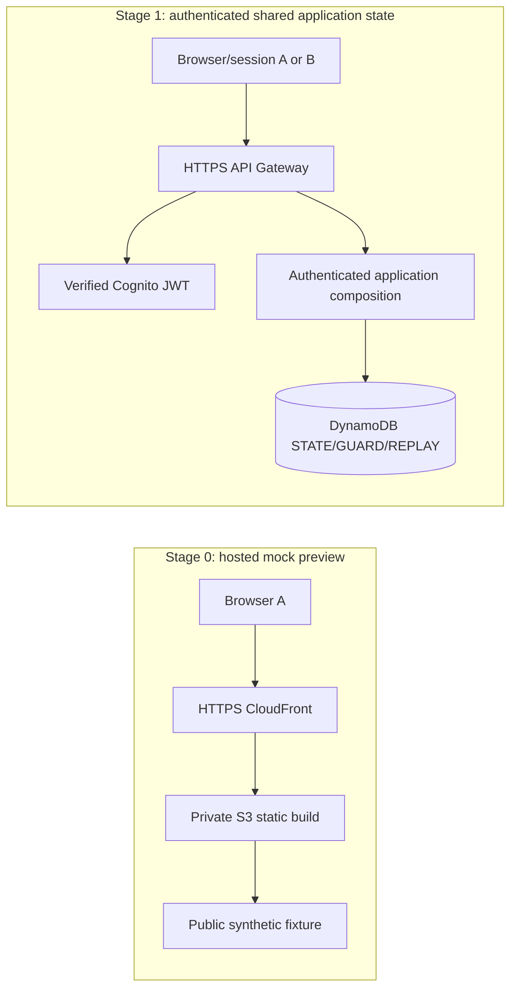

# Known Enough AWS staging runbook

**Project sign-off policy, 2026-09-27:** human acceptance checkpoints are temporarily deferred. Stage completion is based on technical evidence and named independent reviews. This does not authorize cloud changes: present and obtain explicit authorization for each concrete resource/deployment/spending scope before acting.

## Live Stage 0 deployment — 2026-09-27

**Status: deployed and reachable over HTTPS.** This is the accepted static mock preview only. It has no login, authenticated API, DynamoDB, or shared application state. Each visitor sees the same fixed synthetic fixture; local-only demo identities remain disabled.

| Resource | Deployed value |
| --- | --- |
| AWS account / deployment region | `092954139775` / `us-east-1` (N. Virginia) |
| S3 bucket | `known-enough-preview-20260927-7f94b6a1` (private; Block Public Access on; owner-enforced; SSE-S3; versioning and 14-day noncurrent-version expiry) |
| CloudFront distribution | `E61V9RN1W6E0` (`PriceClass_100`, HTTPS redirect, default root `hosted-preview/index.html`) |
| CloudFront hostname | [`https://d23eowhnwtqts3.cloudfront.net/`](https://d23eowhnwtqts3.cloudfront.net/) |
| Origin Access Control | `E10RFHXAY9PCCP` (SigV4, always sign) |
| Release SSO role | `AWSReservedSSO_KnownEnoughStage0Release_7b9815dcafb9e5f6/martelaxe` via `known-enough-staging-deploy` |
| Cleanup tag date | `2026-10-04` |

The exact reviewed artifact from `a625498` was uploaded without `--delete`; invalidation `I7D8IJ7JLX46A8DR8XNRWLL5Q1` completed. HTTPS checks returned 200 for the root page and JavaScript asset. The uploaded files were `hosted-preview/index.html` (`574954696e5098f34cfedb1fda0e2942f7df781a4e07e58bc6adb366a51c32fe`), `assets/index-CohlOwP-.js` (`eccc59393bcda465c1dfa3e20f38fe28f7013ef21be998323cb095db061de379`), and `assets/index-Bh2GWqRh.css` (`786e7c506ddb978f62cac8cc40ea0e67e28e74489701c9d8dc76ace55c2fee23`).

Authentication recorded before deployment: AWS CLI v2.37.4; `known-enough-staging-ro` verified as `AWSReservedSSO_ReadOnlyAccess_4a73ffa8d53b9573/martelaxe`; the explicitly authorized temporary provisioning permission set was created/assigned for setup, then its assignment and permission set were removed. The deployment profile above remains. The root bootstrap profile was used only for the specifically authorized setup actions, including installing the exact reviewed bucket policy and tagging the distribution. No credentials, tokens or login codes are stored here.

Current profile names from `aws configure list-profiles`: `known-enough-staging`, `known-enough-staging-ro`, `known-enough-staging-bootstrap`, and `known-enough-staging-deploy`. The `known-enough-staging` root-login session was logged out; its profile stanza remains. `known-enough-staging-bootstrap` is the root bootstrap profile. `known-enough-staging-ro` is the read-only SSO profile. `known-enough-staging-deploy` maps to the named release role in the table above. Always specify `--profile` and deployment `--region us-east-1` explicitly. The Identity Center primary/SSO region is separately `us-east-1`.

The user's earlier `$25/month` planning ceiling is **superseded** by the later instruction to proceed using available credits. No AWS Budget was created and no hard spend cap is configured. The user reported approximately `$250` in credits; this balance and current billing amount were not verified. Actual usage may incur charges. SSO region and deployment region are both `us-east-1` and are separate settings.

Deployment sequence completed through AWS CLI: verified the explicit staging identity; created the private S3 bucket with public-access blocks, owner enforcement, encryption, versioning and lifecycle; created OAC and the CloudFront distribution; installed the exact OAC-only bucket policy with expected-owner validation; tagged the distribution; uploaded only the three reviewed hosted-preview files; invalidated CloudFront and checked HTTPS responses. The temporary setup permission assignment/set was then removed. No browser-console infrastructure edits were used.

**Next:** visit the HTTPS URL above to view the preview. For a later authorized static release, these are the exact CLI commands (run from the repository root after the hosted artifact has passed its checks):

```sh
npm run build:hosted-preview --workspace @deal-table/web
node scripts/check-hosted-preview-bundle.mjs
aws s3 cp apps/web/dist-hosted-preview/hosted-preview/index.html s3://known-enough-preview-20260927-7f94b6a1/hosted-preview/index.html --content-type text/html --cache-control no-cache --profile known-enough-staging-deploy --region us-east-1 --no-cli-pager
aws s3 cp apps/web/dist-hosted-preview/assets/ s3://known-enough-preview-20260927-7f94b6a1/assets/ --recursive --cache-control 'public,max-age=31536000,immutable' --profile known-enough-staging-deploy --region us-east-1 --no-cli-pager
aws cloudfront create-invalidation --distribution-id E61V9RN1W6E0 --paths /hosted-preview/index.html '/assets/*' --profile known-enough-staging-deploy --region us-east-1 --no-cli-pager
```

Wait for that invalidation to complete, then verify `curl -fsSI https://d23eowhnwtqts3.cloudfront.net/` and the referenced JS asset. Never upload the ordinary app build or use `--delete`. API/authentication/DynamoDB work belongs to KE13B and remains gated; final live operational acceptance remains KE13.

## Decisions and boundary

- Deployment region: `us-east-1` (N. Virginia), selected as a North America planning default with current public pricing examples. The IAM Identity Center **SSO region is also `us-east-1`**, confirmed separately as the Identity Center primary region.
- The former `$25/month` estimate below is historical planning only; the user later waived that ceiling in favor of available credits. No budget or hard cap exists. The reported credit balance is unverified; check account billing before future stages. Any budget alert is informational, not a guaranteed stop.
- Stage 0 is an HTTPS static **hosted mock preview** backed only by public synthetic fixtures. Each browser sees mock state; it does not provide shared application state, authentication, or durable writes.
- Stage 1 uses the Vercel project recorded in [the connected-site CLI handoff](ke13-vercel-site.md) for the regular app, and adds verified Cognito identity, HTTPS API and durable DynamoDB state in AWS. Separate sessions must read/write the same DynamoDB room state to demonstrate shared application state. The deployed Stage 0 CloudFront mock remains separate and unchanged.
- SQS/DLQ is deferred until a real asynchronous worker exists. Bedrock/model calls are excluded and remain disabled until separately implemented and authorized.
- Stage 0 S3/CloudFront resources are deployed as recorded above. At that Stage 0 checkpoint there was no authenticated API, Cognito pool, or DynamoDB table. KE13 later deployed the separate Stage 1 Vercel/Cognito/API/Lambda/DynamoDB slice below. No CDK bootstrap, SQS queue, or paid model call was created.

## Current repository readiness

| Boundary | Existing evidence | Staging implication |
| --- | --- | --- |
| Web | The Stage 0 [`hosted-preview/index.html`](../apps/web/hosted-preview/index.html) entry fixes the public fixture and ignores query strings. The regular production entry loads the Cognito-connected app only when all six public `VITE_*` values are configured; otherwise it displays a configuration error. | Stage 0 continues to use only `apps/web/dist-hosted-preview/` on CloudFront. Vercel is the active Stage 1 frontend until the new [Amplify GitHub Actions deployment](amplify-hosting.md) serves the same `apps/web/dist/` build and its Cognito/API origin checks pass. User accepted the reported independent Stage 0 PASS; see [review evidence](../docs/reviews/KE13C.md). |
| Local API | [`apps/api/README.md`](../apps/api/README.md) documents in-memory local state and fixed `NON_PRODUCTION` test labels. The local handler refuses `NODE_ENV=production`; its listener is loopback-only. | Never expose the local handler, test identity header or mock identities over the internet. They are not authentication. |
| Authenticated API | KE13B's reviewed API Gateway v2 Lambda entry point is deployed with the Cognito JWT verifier and application. | API `u94iyvt6p9` is live in `us-east-1`; verify signed participant/display scopes without a local identity fallback. |
| Persistence | The KE13B Lambda uses the versioned DynamoDB transaction adapter and strict STATE v6 codec in [`packages/adapters`](../packages/adapters/README.md). | Table `KnownEnoughStage` is PAY_PER_REQUEST with the synthetic decision seeded. No automatic migration; older durable STATE schemas require a separately reviewed migration. |
| Workers/model | [`apps/workers/README.md`](../apps/workers/README.md) is a placeholder. | Do not create queues, invoke Bedrock or place private prompt text in SQS. Add SQS/DLQ and Bedrock only in their gated implementation scope. |

### What each stage proves



The Stage 0 browser only renders fixture state; one browser’s action cannot update another browser. Stage 1 is real shared state only after two independently authenticated, authorized sessions exercise the same deployed API and DynamoDB room, with transaction/version behavior verified. A static page, local API, mocked Cognito token or DynamoDB Local run does not meet that evidence.

## AWS CLI/profile setup and read-only verification

### Current discovery

- WSL initially had no `aws` executable. Windows `where.exe aws`, PowerShell command lookup and common Windows CLI v2 install paths also found no executable. WSL and Windows standard `~/.aws/config` paths are absent; `AWS_CONFIG_FILE`, `AWS_SHARED_CREDENTIALS_FILE`, `AWS_PROFILE` and region override variables were unset.
- Installed AWS CLI **v2.37.4** in the WSL user profile from AWS’s official Linux installer. The installer verified the package’s GPG signature. `aws --version` succeeded.
- At initial discovery, `aws configure list-profiles` returned no names and no standard WSL/Windows CLI profile existed. The user first created `known-enough-staging` with `aws login`; WSL could not auto-open the browser, but STS verified the account root principal. The user then ran `aws logout --profile known-enough-staging`, which removed the cached login credentials. The user created IAM Identity Center user `martelaxe`, assigned the AWS managed `ReadOnlyAccess` permission set to this account, and configured `known-enough-staging-ro`. Device-code SSO login completed; WSL could not auto-open the browser, but the user completed browser authorization. A repeat explicit-profile STS check succeeded for the `AWSReservedSSO_ReadOnlyAccess_…/martelaxe` assumed role. The account ID was reported directly to the user and is omitted here. The Identity Center dashboard primary region is `us-east-1`; `aws configure get region --profile known-enough-staging-ro` returned deployment region `us-east-1`. No login codes, tokens or authorization URLs are recorded here.

### Recommended path if the AWS account uses IAM Identity Center (SSO)

The user has configured this profile successfully. For another local setup, run these in WSL using the AWS access portal URL from the IAM Identity Center dashboard and that instance’s primary region. Do not put passwords, MFA responses, access keys, tokens or device codes in chat, source control, the runbook or logs. All service and permission-set changes below are CLI actions; a browser is used only when AWS CLI requests SSO/device authorization.

```sh
aws configure sso --profile known-enough-staging-ro --use-device-code
```

In the interactive wizard, enter the AWS access portal URL and **SSO region**; accept the default `sso:account:access` scope; choose the staging account and the least-privilege permission set; set the profile’s **deployment region** to `us-east-1`. This creates a local CLI profile. It does not create AWS infrastructure. Do not paste the profile config or SSO token cache into the repository.

Then authenticate and verify the selected account/role:

```sh
aws sso login --profile known-enough-staging-ro --use-device-code
aws sts get-caller-identity --profile known-enough-staging-ro --no-cli-pager
aws configure get region --profile known-enough-staging-ro
aws configure list-profiles
```

The Identity Center SSO region is shown as **Primary Region** on the Identity Center dashboard; the CLI profile region is the deployment region. Modern CLI profiles store the SSO region in their named `sso-session` section, so `aws configure get sso_region --profile ...` may not return it. Report the `Account` and the principal shown by `Arn` separately from both regions; if the ARN is an assumed role, record its role name, and if it is an IAM user, do not describe it as a role. If the CLI requests device authorization, complete that sign-in in a trusted browser; resource and permission changes below use the CLI.

```sh
aws sso login --profile known-enough-staging-ro --use-device-code
```

The CLI may display a one-time code in the terminal; enter it only at the AWS device authorization page. Do not copy the code into chat or project files.

### If access uses a different method

- Use the existing IAM Identity Center profile and its SSO flow. Do not replace it with long-lived keys.
- For an organization-provided assume-role or credential-process profile, follow that profile's existing local authentication method. Never send static keys or MFA codes to the assistant. Prefer short-lived, scoped credentials over long-lived IAM-user keys.
- Always pass the chosen profile on AWS service commands. Do not rely on an ambient default profile.

### Read-only identity checkpoint

After login, first run only the STS command above. Stop if the AWS account or role is not the intended staging authority. Record verified account/role details only in a human-approved private operations record, not a public frontend, browser payload, source code or credential file. **Current result: `known-enough-staging-ro` verifies as the `ReadOnlyAccess` assumed role.** This identity permits read-only verification, not staging deployment; request a separate scoped write permission set only after the stage and exact resources are approved.

## Staged resource inventory

The Stage 0 values are listed above. The Stage 1 resource IDs are recorded below. Tag supported staging resources with `Project=KnownEnough`, `Environment=staging`, `Stage=preview` or `Stage=api`, and a cleanup date. OAC has no supported tag operation in the inspected authorization reference.

| Stage | Resource | Purpose and limits |
| --- | --- | --- |
| Preview | Amazon S3 Standard bucket | Store only the reviewed `apps/web/dist-hosted-preview/` build. Block all public access, disable website hosting, use CloudFront Origin Access Control, default SSE-S3, versioned release assets and a 14-day cleanup for noncurrent versions. No private inputs or credentials. |
| Preview | Amazon CloudFront distribution | Serve S3 through OAC over HTTPS; set `DefaultRootObject=hosted-preview/index.html`. Prefer the CloudFront-provided domain and the $0 flat-rate Free plan if eligible; keep its published 1M requests/100 GB monthly allowance in view. Enable only the required security headers. Do not put participant values or identifiers in URLs/logs. |
| Preview | AWS Certificate Manager public certificate | Optional only for a custom domain. Request a non-exportable certificate in `us-east-1` for CloudFront. Integrated public certificates have no separate charge. The default CloudFront hostname already provides HTTPS. |
| Preview | Route 53 zone/records | Optional only if the user supplies an existing domain hosted in Route 53. Do not register or transfer a domain for this task. A hosted zone is billed monthly. |
| App | Vercel static frontend | Project `known-enough-staging`; deploy configured `apps/web/dist` using the pinned local build and `vercel deploy --prebuilt`. No custom domain or plan upgrade. |
| API | Amazon Cognito User Pool | Only after KE13B: participant and display app clients, public sign-up disabled, short access-token lifetime, administrator-managed display group; synthetic test accounts only. Avoid SMS MFA. Runtime JWT verification uses public JWKS and needs no Cognito API permission. |
| API | API Gateway HTTP API | HTTPS JSON API routes to Lambda, throttling enabled, JWT authentication/authorizer configured from verified Cognito issuer/client IDs. |
| API | AWS Lambda function(s) | Request composition; bounded memory/timeout; no VPC/NAT for the initial serverless path. API Gateway throttling is 5 requests/second with burst 10. Reserved concurrency is unset because AWS rejected a reservation of 5 that would reduce unreserved capacity below the account's minimum of 10. Runtime role cannot provision infrastructure. |
| API | One DynamoDB Standard on-demand table | `KnownEnoughStage` with the existing adapter’s `ROOM#...` partition and STATE/GUARD/REPLAY sort keys. Single region; set supported on-demand throughput maxima after measured adapter sizing. No TTL for authorization/expiry. Do not enable global tables. |
| API | CloudWatch Logs groups, alarms and metrics | Redacted operational categories only; 7-day retention for staging; alert on error/throttle/cost signals. Never log JWTs, private input/conditions, prompts, grant IDs or refusal details. |
| Deferred | SQS standard queue + DLQ | Add only with a real reviewed async worker. Queue envelopes carry opaque job/authorized record references, not raw conversation text. Bound retention/redrive and cap worker concurrency. |
| Excluded | Bedrock, NAT Gateway, EC2, RDS, load balancer, paid domain registration, exportable/Private CA, SMS, global table, provisioned database capacity | Not needed for the first mock preview and would add variable or standing cost. Reconsider only under later explicit scope/approval. |

## Current Stage 1 deployment — 2026-09-29

| Component | Deployed value |
| --- | --- |
| AWS identity | Profile `known-enough-staging-bootstrap`; STS principal `arn:aws:iam::092954139775:root` in account `092954139775`. |
| Regions | AWS deployment region `us-east-1`; IAM Identity Center primary/SSO region `us-east-1`. The Stage 1 operator used the root bootstrap profile because no Stage 1 permission set existed. |
| Frontend | Vercel project `known-enough-staging`, project ID `prj_sjf1XvHqmDtSDyqJJcqrDQS8lseY`; stable production URL [`https://known-enough-staging.vercel.app/`](https://known-enough-staging.vercel.app/); current deployment ID `dpl_Ftgo7kyZqKB6xpZdrGLn9obMdTz4`; sorted build-manifest SHA-256 `eb07363fe5d0ab7fc98e007d4a4122fd90bd7e05079888cdbb3459fbf4ae33de`. |
| AWS frontend automation | Amplify app `known-enough-staging-amplify`, app ID `d143q5ravxp5av`, branch `main`, region `us-east-1`; GitHub OIDC provider `arn:aws:iam::092954139775:oidc-provider/token.actions.githubusercontent.com`; role `KnownEnoughAmplifyMainDeploy`. The app/branch/OIDC provider/role exist. Workflow and first deploy are in progress; expected URL `https://main.d143q5ravxp5av.amplifyapp.com/` is not yet verified or active. See [Amplify runbook](amplify-hosting.md). |
| Cognito | User pool `us-east-1_V9OMjd0zx`; domain prefix `known-enough-092954139775`; participant client `3accf7paalvon2m8ue8okfi853`; display client `481ru24906sv26f30i569gq8g0`; public signup disabled; access tokens 15 minutes; callbacks/logout match the Vercel URL. |
| API | HTTP API `u94iyvt6p9`; base URL `https://u94iyvt6p9.execute-api.us-east-1.amazonaws.com`; protected `ANY /decisions/{proxy+}` JWT route plus public `OPTIONS` preflight; 5 requests/second and burst 10. |
| Compute/storage | Lambda `known-enough-stage-api`, Node.js 24, 512 MB, 29-second timeout; runtime role `KnownEnoughStageApiRole`; DynamoDB `KnownEnoughStage`, on-demand billing, two seeded STATE/GUARD records; log group `/aws/lambda/known-enough-stage-api`, seven-day retention. Runtime policy SHA-256 `db9a80f35ce4235fad44d84af7411c0a5020240e38ce20d3798d5d8193d75b12`; Lambda ZIP SHA-256 `8e01ad21d9233b834b76e1aee77d32e37f6898f5827c49182c64d54fe1b26211`. |
| Smoke and remaining proof | Site returned 200 and browser showed the sign-in screen with no page errors; participant sign-in reached Cognito. User reports successful participant sign-in; a read-only user-pool check confirms `participant-b-staging` is enabled/CONFIRMED. Unauthenticated, test-header-only and invalid-token API requests returned 401; allowed-origin CORS returned 204 and an unrelated origin received no allow-origin header. Cognito OIDC issuer and API JWT audiences match. `display-staging` and four other synthetic participants remain `FORCE_CHANGE_PASSWORD`; authenticated shared-state and display checks remain pending. |

No Vercel upgrade, custom domain, Stage 0 modification, SQS, Bedrock or budget alert was created. The AWS credit balance and current bill were not checked. The account-root bootstrap identity is not a reusable least-privilege Stage 1 operator; record this before future incremental AWS changes.

## Deployment sequence

Steps 1–6 record the completed Stage 0 deployment. Steps 7–10 record current Stage 1 status. The `$25/month` planning ceiling was later waived by the user; the reported AWS credits and actual bill remain unverified.

1. **Confirm local auth and account.** Run `aws sso login --profile known-enough-staging-ro --use-device-code`, then `aws sts get-caller-identity --profile known-enough-staging-ro --no-cli-pager` and `aws configure get region --profile known-enough-staging-ro`. Stop unless the account and role are the intended account and `ReadOnlyAccess`. Cost Explorer previously reported estimated unblended cost of `$0` from 2026-09-01 through 2026-09-27; read-only inventory found no S3 buckets, CloudFront distributions or AWS Budgets. This does not reveal the remaining credit balance.
2. **Budget alert (skipped).** The user later waived the `$25/month` planning ceiling in favor of available credits. No budget was created, the credit balance was not verified, and no hard stop exists. The old command/design notes below are historical and are not a requirement for the deployed preview.
3. **Use the reviewed hosted-only mock build.** The accepted commit is `a625498`. It builds the fixed public fixture in `apps/web/dist-hosted-preview/`, ignores owner/local/scenario query strings and displays “Hosted mock preview — simulated data, no shared state.” Upload only this directory. The reviewer’s reported probes and two non-blocking permanent-check gaps are recorded in [KE13C build review](../docs/reviews/KE13C.md), with current output hashes.
4. **Provisioning authority (completed; candidate policy not used).** The user authorized CLI setup. A temporary Identity Center permission set/assignment was created for setup and removed after use. The expired [KE13A-P candidate](../docs/tasks/KE13A-provisioner-policy.md) was not assigned or used. The trusted setup identity created the named bucket, OAC and distribution; installed the exact reviewed OAC-only bucket policy and applied tags. The remaining command snippets below are reference material, not commands to rerun against the deployed resources.

   After a later authorized provisioning session returns actual IDs, fail closed on every lookup: reject failed, empty, null, placeholder, foreign-account or ID-mismatched output; verify the ARN format and S3/OAC origin against the reviewed request. Render [the OAC-only bucket resource policy](permissions/ke13c-preview-bucket-policy.json) using only that verified ARN. A separate trusted administrator must review the rendered policy, install exactly that document with `--expected-bucket-owner 092954139775`, and read it back; no reusable provisioning/release role gets `s3:PutBucketPolicy`. The permission design documents this remaining trusted CLI gate. Initial defaults, versioning/lifecycle/tags, OAC settings, HTTPS behavior and the exact accepted build must be verified before upload. Use explicit `--profile "$STAGE0_PROVISIONER_PROFILE" --region us-east-1 --no-cli-pager` for the authorized provisioner; the separate bucket-policy action requires its own authorized trusted profile.

5. **Release role setup (completed).** `known-enough-staging-deploy` is assigned and verified for `AWSReservedSSO_KnownEnoughStage0Release_7b9815dcafb9e5f6/martelaxe`. Its reviewed policy is restricted to the hosted-preview/assets prefixes and the exact distribution ARN. The temporary setup permission set was deleted; the KE13A-P candidate was not used.
6. **Initial release (completed).** The accepted hosted-only build was uploaded without `--delete`, the distribution invalidated, and HTTPS root/JavaScript responses returned 200. Use the reusable commands in the “Next” section above for future static releases; do not recreate permission sets or rerun provisioning.

7. **KE13B implementation/review (complete).** Authenticated composition, durable adapter wiring and the exact runtime policy passed the named focused independent review; see [KE13B evidence](../docs/reviews/KE13B.md).
8. **Stage 1 deployment (complete through CLI).** The user authorized Vercel + Cognito/API Gateway/Lambda/DynamoDB/runtime IAM/CloudWatch in `us-east-1`. The bootstrap profile authenticated as account root because no Stage 1 permission set existed. Exact IDs and artifact hashes are recorded above and in [KE13](../docs/tasks/KE13.md). This did not modify the accepted Stage 0 mock.
9. **Basic live smoke (passed).** HTTPS frontend returns 200 and the participant UI reaches Cognito. Unauthenticated requests are denied; exact-origin CORS and JWT authorizer configuration pass. These checks do not prove authenticated shared-state use.
10. **Finish KE13 acceptance.** Participant sign-in is user-reported successful. Verify authenticated `/public` and `/me`, a write/reload, other-member denial, replay/conflict behavior, expiry and redacted logs. The connected page has no decision-editing UI, so persistence testing needs an authenticated API call. Set a local password for `display-staging` and verify public read plus write denial. Record results without passwords/tokens. KE13 stays IN_PROGRESS until this is complete. Keep Bedrock/SQS disabled and obtain the named KE09 cloud-boundary follow-up before external testers.

## Historical cost estimate (original $25/month planning assumption)

Planning estimate dated 2026-09-26, in USD, for `us-east-1`; use the AWS Pricing Calculator with the actual account/usage before any creation. Assumptions: one small static build (<1 GB), ≤10 GB/month page delivery and ≤100,000 HTTPS requests; after Stage 1, ≤10,000 HTTP API calls/month, ≤10 synthetic monthly active users, one small on-demand table with 1–10 KB average items, ≤0.5 GB logs/month, no more than 10,000 async jobs if SQS is later added, no Bedrock, no SMS, no cross-region traffic and no purchased domain.

| Component | Low-traffic planning estimate | Cost basis / note |
| --- | ---: | --- |
| CloudFront preview distribution | `$0/month` if the flat-rate Free plan is available and usage is within 1M requests/100 GB. Otherwise budget roughly `$1–$3/month` for the stated small pay-as-you-go preview and verify in Calculator. | The Free plan includes CDN, TLS, DNS, logs and monthly S3 storage credits. Confirm account eligibility and plan terms before selecting it. |
| S3 static build | `$0–$0.10/month` | One small build and request volume; included S3 credits may cover it on a CloudFront plan. No cross-region or direct public S3 delivery. |
| ACM public certificate | `$0` for a non-exportable certificate used by CloudFront/API Gateway. | Custom domain only; CloudFront certificate is requested in `us-east-1`. |
| HTTP API Gateway | About `$0.01/month` at 10,000 requests. | AWS’s HTTP API example is `$1.00` per million requests in the first tier. Payload transfer is low under the stated size limit. |
| Lambda | About `$0.02/month` at 10,000 requests, 512 MB, 200 ms average, before free-tier credits. | Includes request and x86 duration estimate; actual duration, memory, retries and account free usage change this. |
| DynamoDB Standard on-demand | Roughly `$0.10–$1/month` at 10,000 small transaction paths, depending on STATE/item sizes and transaction units. | AWS lists US East examples at `$0.625/M` write units and `$0.125/M` read units; transactional operations consume extra units. Adapter operations and item bytes must be measured before finalizing. First 25 GB storage free tier only if available in this account. |
| Cognito | `$0` expected for ≤10 direct/social MAUs on Lite/Essentials, if the account’s free tier applies and SMS is not used. | SAML/OIDC federation has a 50-MAU free tier; higher tiers, advanced features, SMS and email delivery can add cost. Select and verify the tier. |
| CloudWatch | `$0–$0.25/month` for ≤0.5 GB log ingestion under the current 5 GB free allowance; otherwise `$0.50/GB` at the first standard ingestion tier, plus any retained storage/queries. | Seven-day retention and redacted, low-volume logs assumed. Do not enable verbose request logs. |
| SQS + DLQ, if later needed | `$0` expected at 30,000 request actions; then `$0.40 per million` standard queue requests after the first million monthly requests. | 10,000 jobs × send/receive/delete. Batch where appropriate; payload size and retries increase request count. |
| Route 53 hosted zone, optional | Add `$0.50/month` for the first hosted zone, plus queries. | Avoid by using the CloudFront hostname. Domain registration is excluded. |

**Planning total (historical AWS estimate):** Preview only was approximately `$0–$3/month`; AWS preview plus low-traffic API/Cognito/DynamoDB was approximately `$1–$8/month`, excluding Vercel. Vercel's exact project plan and current billing were not checked; deployment completed without a plan-upgrade prompt. Traffic, logs, free-tier eligibility, retries, item size, support, taxes or other existing account use can change actual costs. AWS credits were reported by the user but not verified. AWS Budgets sends alerts and optional actions; it cannot guarantee a hard account spend cap. Keep Bedrock disabled because token/model/region usage is variable and is not included.

Official references: [AWS CLI v2 install](https://docs.aws.amazon.com/cli/latest/userguide/getting-started-install.html), [IAM Identity Center CLI setup/device flow](https://docs.aws.amazon.com/cli/latest/userguide/cli-configure-sso.html), [CloudFront actions and resource scopes](https://docs.aws.amazon.com/service-authorization/latest/reference/list_cloudfront.html), [S3 permissions and resource scopes](https://docs.aws.amazon.com/AmazonS3/latest/userguide/using-with-s3-policy-actions.html), [S3 default Block Public Access settings](https://docs.aws.amazon.com/AmazonS3/latest/userguide/create-bucket-overview.html), [IAM policy variables](https://docs.aws.amazon.com/IAM/latest/UserGuide/reference_policies_variables.html), [CloudFront plans](https://aws.amazon.com/cloudfront/pricing/), [S3](https://aws.amazon.com/s3/pricing/), [API Gateway](https://aws.amazon.com/api-gateway/pricing/), [Lambda](https://aws.amazon.com/lambda/pricing/), [DynamoDB](https://aws.amazon.com/dynamodb/pricing/), [Cognito](https://aws.amazon.com/cognito/pricing/), [SQS](https://aws.amazon.com/sqs/pricing/), [CloudWatch](https://aws.amazon.com/cloudwatch/pricing/), [ACM](https://aws.amazon.com/certificate-manager/pricing/), [Route 53](https://aws.amazon.com/route53/pricing/), [AWS Budgets authorization](https://docs.aws.amazon.com/service-authorization/latest/reference/list_budgets.html), [AWS Budgets pricing](https://aws.amazon.com/aws-cost-management/aws-budgets/pricing/) and [AWS Budgets alert timing](https://docs.aws.amazon.com/cost-management/latest/userguide/bcm-lite-use-budget.html). Prices/free allowances can change and can depend on account eligibility; recheck before authorization.

## Required permissions

The `known-enough-staging-ro` `ReadOnlyAccess` profile is for identity/inventory checks. The bootstrap profile was root and used only for the user-authorized setup operations described above; do not use it for incremental application releases. The temporary provisioning permission set is deleted. The active `known-enough-staging-deploy` role uses the exact reviewed [release policy](permissions/ke13c-stage0-deploy.json); it cannot create/configure/tag/delete the distribution, administer IAM/billing, or change the bucket policy. The exact [OAC-only bucket policy](permissions/ke13c-preview-bucket-policy.json) is installed. Do not attach `AdministratorAccess`.

| Actor/stage | Permission families to request after review |
| --- | --- |
| Read-only verification | `sts:GetCallerIdentity`; no service mutation permission. |
| Preview initial provisioning (Stage 0) | Complete. A temporary setup permission set/assignment was created through CLI and removed after provisioning. The unaccepted KE13A-P candidate was not used and must not be assigned. Exact deployed resources are listed above. |
| Preview incremental release | The [Stage 0 release policy](permissions/ke13c-stage0-deploy.json), after recorded independent PASS and rendered revalidation, may be used only for an explicitly authorized release. It allows `s3:ListBucket` only with either allowed prefix, `s3:GetObject`/`s3:PutObject` only under `hosted-preview/*` and `assets/*`, and distribution read/invalidation actions only on that exact distribution ARN. It has no bucket-policy, bucket-configuration, create, tag, delete or wildcard-distribution action. |
| API staging control plane | API Gateway HTTP API create/update/delete; Lambda create/update/delete and pass execution role; Cognito user-pool/app-client/group provisioning; DynamoDB table create/describe/update/delete and billing-mode/on-demand limit configuration; CloudWatch log-group/retention/alarm management; optional SQS queue/DLQ create/update/delete only when worker code exists; AWS Budgets and cost-allocation-tag activation as authorized. IAM role/policy creation and `iam:PassRole` must be constrained to the exact staging roles and intended services. |
| Runtime API role | Existing adapter’s transaction-scoped DynamoDB item actions only: `dynamodb:GetItem`, `dynamodb:PutItem`, `dynamodb:UpdateItem` on the exact table ARN, with `dynamodb:EnclosingOperation` limited to `TransactGetItems`/`TransactWriteItems` and `dynamodb:LeadingKeys` limited to `ROOM#*`. Add only exact log-group write actions. No table administration, `DeleteItem`, `Query`, `Scan`, IAM, Cognito admin or broad resource wildcard. |
| Runtime worker role, only if implemented | Only the specific queue’s send/read/delete/get-attributes actions, exact table transaction needs and exact log group. No raw prompt text in the queue; do not grant Bedrock until its separate KE10 scope is authorized. |

Before deployment, an explicit-profile `HeadBucket` check returned 404 for the now-deployed bucket `known-enough-preview-20260927-7f94b6a1`. General-purpose bucket names use a global namespace; the name was available at creation. If a future account returns `BucketAlreadyExists`, stop and choose a new bucket name before rendering exact S3 ARNs.

The deployed runtime IAM policy was generated from KE13B's reviewed policy for the exact `KnownEnoughStage` and `/aws/lambda/known-enough-stage-api` ARNs; its hash is recorded above. It permits only transaction-scoped `GetItem`, `PutItem`, `UpdateItem` on `ROOM#*` keys and exact log-stream writes. A key-prefix condition does not replace application membership authorization. The account-root profile used for setup is not least-privilege; a scoped operator permission set is still needed before routine future AWS changes.

## Cleanup and expiry

Use synthetic test records only. Set a dated cleanup reminder at creation. Cleanup is a documented future procedure; do not execute it without explicit scope approval and resource-ID review.

1. Disable public preview traffic or restrict access; record the final build hash/evidence; remove DNS aliases only if they were created for this staging deployment.
2. Disable the CloudFront distribution and wait until deployment state is disabled; then delete the distribution and its Origin Access Control only after confirming no other distribution references it.
3. Delete every object version and delete marker from the dedicated build bucket; delete the bucket after CloudFront releases it. Confirm the bucket contains no unrelated objects.
4. For API staging, stop/disable API routes and Lambda event sources; delete the API and only the named Lambda functions. Remove only the scoped runtime role/policy after its functions are gone.
5. Purge synthetic SQS messages; delete the dedicated DLQ and source queue. Remove only matching staging log groups after exporting any approved redacted evidence; delete staging alarms/metrics that incur charges.
6. Delete Cognito synthetic users/groups and the dedicated pool/app clients after confirming no other stage depends on them. No private/real user data belongs in this pool.
7. Delete the dedicated DynamoDB staging table only after confirming it contains synthetic test state and no separate acceptance evidence needs retention. Check and remove on-demand backups, exports and point-in-time recovery state created for this stage; do not delete unrelated tables or backups.
8. Remove the optional ACM certificate after distribution/API associations are removed. Delete only staging Route 53 records. Do not delete a shared hosted zone or register/transfer a domain as part of cleanup.
9. Remove staging-specific budget filters, alarm targets and cost-allocation tags only if they were created solely for this stage; retain any account-wide budget or shared control. Verify the AWS bill and resource inventory after cleanup; record residual charges and the cleanup date.

## Remaining work / next action

- Stage 0 cleanup is scheduled by the `CleanupAfter=2026-10-04` tag; do not delete resources without explicit cleanup authorization. Follow the procedure below and empty all bucket versions before bucket removal.
- The historical KE13A-P candidate policy was not used for deployment; its temporary permission set was created for setup and deleted afterward. Do not assign that expired candidate. The exact release profile and trusted bucket-policy installation path used for Stage 0 are documented above.
- The accepted Stage 0 preview remains public synthetic mock data. No account-level hard spend cap or budget alert was created. AWS credits and current billing were not verified.
- KE00, KE13A and KE13B remain DONE for their recorded scopes; B04/B04.5 remain REVIEW with project sign-off deferred. KE12 is deferred. Participant login is user-reported successful and Cognito marks `participant-b-staging` CONFIRMED. KE13 still needs authenticated shared-state and display-only evidence; a scoped Stage 1 operator identity should precede later incremental AWS changes.

## KE11 Cognito identity — deployed values and login handoff — 2026-09-29

KE13 created the Cognito pool, clients, domain, synthetic users and display group in the table above. **Do not rerun the resource-creation commands below.** They are retained as the original setup recipe. User B does not receive AWS credentials; User A sets a password for the dedicated test username locally and shares it with B only through a private channel. Never put the password in chat, a repository file or a log.

The participant account `participant-b-staging` is bound to Maya's synthetic membership. Its password is set and Cognito reports `CONFIRMED`; do not reset it. To prepare the separate read-only display login, set `display-staging`'s permanent test password from the operator's WSL terminal using a hidden prompt:

```sh
read -rsp 'New display test password: ' KE13_TEST_PASSWORD
printf '\n'
aws cognito-idp admin-set-user-password --profile known-enough-staging-bootstrap --region us-east-1 \
  --user-pool-id us-east-1_V9OMjd0zx --username display-staging \
  --password "$KE13_TEST_PASSWORD" --permanent --no-cli-pager
unset KE13_TEST_PASSWORD
```

Repeat with `--username display-staging` when preparing the display-login probe. The `display-staging` user is in group `deal-table-display-christmas-decision` and is not a participant. User B then signs in at [`https://known-enough-staging.vercel.app/`](https://known-enough-staging.vercel.app/) and tests participant state using B's own browser session. A must not sign in as B. No username/password is written to repository artifacts.

Required A profile actions for this identity slice: `sts:GetCallerIdentity`; `cognito-idp:CreateUserPool`, `DescribeUserPool`, `DeleteUserPool`, `CreateUserPoolClient`, `DescribeUserPoolClient`, `DeleteUserPoolClient`, `CreateUserPoolDomain`, `DescribeUserPoolDomain`, `DeleteUserPoolDomain`, `AdminCreateUser`, `AdminGetUser`, `AdminDeleteUser`, `AdminSetUserPassword`, `CreateGroup`, `DeleteGroup`, `AdminAddUserToGroup`, and `ListUsers`. Scope mutating post-creation actions to the dedicated staging pool ARN once its ID exists. KE13B will specify separate API, Lambda, DynamoDB and runtime-role permissions. The existing read-only/static-release profiles cannot provision this slice. See the [AWS user-pool CLI](https://docs.aws.amazon.com/cli/latest/reference/cognito-idp/create-user-pool.html), [client CLI](https://docs.aws.amazon.com/cli/latest/reference/cognito-idp/create-user-pool-client.html), and [domain CLI](https://docs.aws.amazon.com/cli/latest/reference/cognito-idp/create-user-pool-domain.html).

Before running commands, A fills `REPLACE_PROFILE` with the specifically approved CLI profile, `REPLACE_ACCOUNT_ID` with the `sts` result, `REPLACE_APP_ORIGIN` with the final HTTPS regular-app origin (the Stage 0 static preview is not the regular app), and `REPLACE_UNIQUE_PREFIX` with an available Cognito prefix. The callback and logout URL must be the **same exact** app root path, including its trailing slash. If the regular app uses a non-root path, use that exact path in both client commands and `index.html` deployment. Do not use localhost callback URLs in the staging clients.

```bash
export KE11_PROFILE=REPLACE_PROFILE
export KE11_REGION=us-east-1
export KE11_APP_ORIGIN=https://REPLACE_APP_ORIGIN
export KE11_DOMAIN_PREFIX=REPLACE_UNIQUE_PREFIX
aws sts get-caller-identity --profile "$KE11_PROFILE" --query '{Account:Account,Arn:Arn}'
# Confirm Account is REPLACE_ACCOUNT_ID and the role has the approved Stage 1 scope.
aws cognito-idp create-user-pool --profile "$KE11_PROFILE" --region "$KE11_REGION" \
  --pool-name known-enough-staging --admin-create-user-config AllowAdminCreateUserOnly=true \
  --query 'UserPool.Id' --output text
export KE11_POOL_ID=REPLACE_POOL_ID_FROM_PREVIOUS_OUTPUT
aws cognito-idp describe-user-pool --profile "$KE11_PROFILE" --region "$KE11_REGION" \
  --user-pool-id "$KE11_POOL_ID" --query 'UserPool.AdminCreateUserConfig.AllowAdminCreateUserOnly'
aws cognito-idp create-user-pool-domain --profile "$KE11_PROFILE" --region "$KE11_REGION" \
  --user-pool-id "$KE11_POOL_ID" --domain "$KE11_DOMAIN_PREFIX" --managed-login-version 1
aws cognito-idp describe-user-pool-domain --profile "$KE11_PROFILE" --region "$KE11_REGION" \
  --domain "$KE11_DOMAIN_PREFIX" --query 'DomainDescription.Status'
aws cognito-idp create-user-pool-client --profile "$KE11_PROFILE" --region "$KE11_REGION" \
  --user-pool-id "$KE11_POOL_ID" --client-name known-enough-participant-browser \
  --no-generate-secret --allowed-o-auth-flows-user-pool-client \
  --allowed-o-auth-flows code --allowed-o-auth-scopes openid \
  --supported-identity-providers COGNITO --callback-urls "$KE11_APP_ORIGIN/" \
  --logout-urls "$KE11_APP_ORIGIN/" --access-token-validity 15 \
  --token-validity-units AccessToken=minutes --prevent-user-existence-errors ENABLED \
  --query 'UserPoolClient.ClientId' --output text
export KE11_PARTICIPANT_CLIENT_ID=REPLACE_PARTICIPANT_CLIENT_ID_FROM_PREVIOUS_OUTPUT
aws cognito-idp create-user-pool-client --profile "$KE11_PROFILE" --region "$KE11_REGION" \
  --user-pool-id "$KE11_POOL_ID" --client-name known-enough-display-browser \
  --no-generate-secret --allowed-o-auth-flows-user-pool-client \
  --allowed-o-auth-flows code --allowed-o-auth-scopes openid \
  --supported-identity-providers COGNITO --callback-urls "$KE11_APP_ORIGIN/" \
  --logout-urls "$KE11_APP_ORIGIN/" --access-token-validity 15 \
  --token-validity-units AccessToken=minutes --prevent-user-existence-errors ENABLED \
  --query 'UserPoolClient.ClientId' --output text
export KE11_DISPLAY_CLIENT_ID=REPLACE_DISPLAY_CLIENT_ID_FROM_PREVIOUS_OUTPUT
aws cognito-idp describe-user-pool-client --profile "$KE11_PROFILE" --region "$KE11_REGION" \
  --user-pool-id "$KE11_POOL_ID" --client-id "$KE11_PARTICIPANT_CLIENT_ID" \
  --query 'UserPoolClient.{Secret:ClientSecret,Callbacks:CallbackURLs,Flows:AllowedOAuthFlows,AccessValidity:AccessTokenValidity}'
aws cognito-idp describe-user-pool-client --profile "$KE11_PROFILE" --region "$KE11_REGION" \
  --user-pool-id "$KE11_POOL_ID" --client-id "$KE11_DISPLAY_CLIENT_ID" \
  --query 'UserPoolClient.{Secret:ClientSecret,Callbacks:CallbackURLs,Flows:AllowedOAuthFlows,AccessValidity:AccessTokenValidity}'
```

Both client descriptions must show no secret, the exact callback URL, `code` flow and 15-minute access validity. Check closed self-registration via `AllowAdminCreateUserOnly=true`. To verify the authorization server without signing in, run `curl -fsSI "https://${KE11_DOMAIN_PREFIX}.auth.${KE11_REGION}.amazoncognito.com/.well-known/openid-configuration"`; fetch its document with `curl -fsS` if `HEAD` is unsupported. The browser obtains a short-lived access token with PKCE, stores it only in tab `sessionStorage`, discards the OAuth state/verifier after one callback, and uses a separate display client. It does not store or use a refresh token. Cognito hosted logout clears the hosted browser session; API bearer tokens can remain valid until their short expiry, so access revocation must also be enforced by the backend membership check. The backend verifies JWT issuer, audience/client ID, token use and display group; a browser label cannot grant membership.

For User B's one dedicated staging login, A fills `REPLACE_B_USERNAME` with a synthetic staging-only username and creates it with **no automatic email/SMS**. A generates a temporary password outside the repository and communicates it to B through an explicitly approved secret channel; do not paste it into a commit, issue, log, or this runbook. The exact CLI operation is below; A supplies the password through an ephemeral secure local input or CLI input file, then deletes that file. The `--temporary-password` placeholder is intentionally not a value to run verbatim. User B changes the temporary password at first sign-in. A must not sign in as B; B performs the browser check with B's own account. Provision the display account separately and add only that account to the room-specific group; never put a participant in the display group.

```bash
aws cognito-idp admin-create-user --profile "$KE11_PROFILE" --region "$KE11_REGION" \
  --user-pool-id "$KE11_POOL_ID" --username REPLACE_B_USERNAME \
  --message-action SUPPRESS --temporary-password REPLACE_B_TEMPORARY_PASSWORD
aws cognito-idp admin-get-user --profile "$KE11_PROFILE" --region "$KE11_REGION" \
  --user-pool-id "$KE11_POOL_ID" --username REPLACE_B_USERNAME \
  --query '{Username:Username,Status:UserStatus}'
aws cognito-idp create-group --profile "$KE11_PROFILE" --region "$KE11_REGION" \
  --user-pool-id "$KE11_POOL_ID" --group-name deal-table-display-christmas-decision
# After separately creating REPLACE_DISPLAY_USERNAME with admin-create-user:
aws cognito-idp admin-add-user-to-group --profile "$KE11_PROFILE" --region "$KE11_REGION" \
  --user-pool-id "$KE11_POOL_ID" --username REPLACE_DISPLAY_USERNAME \
  --group-name deal-table-display-christmas-decision
```

A passes these non-secret values to B for the regular app build: `VITE_COGNITO_REGION=us-east-1`, `VITE_COGNITO_USER_POOL_ID=$KE11_POOL_ID`, `VITE_COGNITO_DOMAIN=https://${KE11_DOMAIN_PREFIX}.auth.${KE11_REGION}.amazoncognito.com`, `VITE_COGNITO_PARTICIPANT_CLIENT_ID=$KE11_PARTICIPANT_CLIENT_ID`, `VITE_COGNITO_DISPLAY_CLIENT_ID=$KE11_DISPLAY_CLIENT_ID`, and `VITE_API_BASE_URL=REPLACE_DEPLOYED_HTTPS_API_BASE_URL`. The API separately needs `COGNITO_USER_POOL_ID`, `COGNITO_PARTICIPANT_CLIENT_ID`, and `COGNITO_DISPLAY_CLIENT_ID`. B's browser build must use `npm run build --workspace @deal-table/web`; the `build:hosted-preview` artifact is the disconnected Stage 0 mock. Never commit a populated `.env` or credentials. [Browser placeholders](../apps/web/.env.example) list the exact names.

KE13 verification after KE13B deployment: A confirms a signed-out API request is `401`, B signs in with B's own account and confirms a `/decisions/christmas-decision/me` request succeeds only after trusted-subject membership provisioning, another owner's private snapshot remains inaccessible, and sign-out or 15-minute expiry requires a new browser session. A signs in with a separate display account and confirms only the public route succeeds; command, owner and invitation writes fail. Record the browser origin, Cognito pool/client IDs, API base URL, HTTP statuses and deployment artifact hash without access tokens, passwords, private inputs or real participant data. These checks belong to KE13, not KE11 code-level acceptance.

Cleanup after the approved staging exercise, after confirming no live dependency: `aws cognito-idp admin-delete-user --profile "$KE11_PROFILE" --region "$KE11_REGION" --user-pool-id "$KE11_POOL_ID" --username REPLACE_B_USERNAME` (and each other synthetic account), then `aws cognito-idp delete-user-pool-domain --profile "$KE11_PROFILE" --region "$KE11_REGION" --user-pool-id "$KE11_POOL_ID" --domain "$KE11_DOMAIN_PREFIX"`, `aws cognito-idp delete-user-pool-client --profile "$KE11_PROFILE" --region "$KE11_REGION" --user-pool-id "$KE11_POOL_ID" --client-id "$KE11_PARTICIPANT_CLIENT_ID"` (repeat for display), and finally `aws cognito-idp delete-user-pool --profile "$KE11_PROFILE" --region "$KE11_REGION" --user-pool-id "$KE11_POOL_ID"`. KE13B supplies the separate API/Lambda/DynamoDB cleanup commands.

## KE13B authenticated backend handoff for KE13 — deployed 2026-09-29

**Deployment record.** KE13B's one focused independent auth/privacy/persistence/IAM review passed. User A directed deployment of this Stage 1 scope on 2026-09-29. The regular app uses the [Vercel CLI handoff](ke13-vercel-site.md); no second S3/CloudFront site was created and the accepted Stage 0 mock was not changed. The active AWS CLI identity was account root via `known-enough-staging-bootstrap`; no Stage 1 permission set existed. Exact deployed values are recorded above. The shell command blocks below are the reproducible original creation recipe; do not rerun the create calls against the existing resources. No real user data, JWTs, passwords, private inputs or invitation tokens enter repository files or logs. The synthetic room has no Bedrock path or SQS/DLQ; reasoning endpoints are disabled in this slice.

The API artifact is `apps/api/src/ke13b-lambda.ts`, bundled for AWS Lambda `nodejs24.x` with pinned Rolldown in the current npm lockfile. The Lambda handler uses the default AWS credential chain only for `DynamoDBRoomRepository`; the separate Cognito JWT verifier downloads public JWKS and the application independently checks current membership. API Gateway's JWT authorizer is an additional gate. HTTP API v2 payloads are forwarded through a loopback-only Node HTTP adapter with an allowlist of request/response headers. Only `Authorization`, `Origin`, `Content-Type` and `X-Request-Id` can enter that adapter; `X-Deal-Table-Test-Identity` cannot. No in-memory room state is used in the deployed composition. The strict DynamoDB codec stores generic STATE v6 with guarded GUARD and exact REPLAY items, rejects unknown/older schemas and never auto-migrates v3/v4/v5 data. Trusted room bootstrap runs as an operator-only local command; it is **not** an API route.

Required A setup profile permissions, limited to the reviewed staging resource names/ARNs wherever the API permits: `sts:GetCallerIdentity`; `dynamodb:CreateTable`, `DescribeTable`, `DeleteTable` and the adapter's transaction item actions for the one table; `logs:CreateLogGroup`, `PutRetentionPolicy`, `DescribeLogGroups`, `DeleteLogGroup`; `iam:CreateRole`, `PutRolePolicy`, `GetRole`, `GetRolePolicy`, `DeleteRolePolicy`, `DeleteRole`, and `iam:PassRole` restricted to the one Lambda role; `lambda:CreateFunction`, `GetFunctionConfiguration`, `AddPermission`, `RemovePermission`, `DeleteFunction`, `UpdateFunctionCode`, `UpdateFunctionConfiguration`; and `apigateway:POST/GET/PATCH/DELETE` for the one HTTP API and its stage/integration/routes/authorizer. The separate site and Cognito setup profiles need their own reviewed scope. The **runtime** role gets only the generated DynamoDB transaction item policy and exact log-stream writes. It gets no IAM, Cognito admin, S3, Bedrock, table administration, `DeleteItem`, `Query`, `Scan`, or direct nontransactional item access. Verify the generated JSON and its SHA-256 before `put-role-policy`; a prefix condition does not replace app membership checks. The design follows [AWS DynamoDB transaction IAM](https://docs.aws.amazon.com/amazondynamodb/latest/developerguide/transaction-apis-iam.html), [HTTP API JWT validation](https://docs.aws.amazon.com/apigateway/latest/developerguide/http-api-jwt-authorizer.html), [Lambda Node 24 runtime](https://docs.aws.amazon.com/lambda/latest/dg/lambda-runtimes.html), and [HTTP API v2 integration](https://docs.aws.amazon.com/apigateway/latest/developerguide/http-api-develop-integrations-lambda.html).

Build on a clean, reviewed KE13B commit with pinned `npm ci`, Node 24.21.0/npm 11.19.0, and the full check already recorded. These commands run **locally** and make no AWS call:

```bash
export KE13B_ARTIFACT_DIR=/tmp/known-enough-ke13b-stage
mkdir -p "$KE13B_ARTIFACT_DIR"
./node_modules/.bin/rolldown apps/api/src/ke13b-lambda.ts --platform node --format esm --no-codeSplitting --file "$KE13B_ARTIFACT_DIR/ke13b-lambda.mjs"
./node_modules/.bin/rolldown apps/api/src/ke13b-provision-run.ts --platform node --format esm --no-codeSplitting --file "$KE13B_ARTIFACT_DIR/ke13b-provision.mjs"
./node_modules/.bin/rolldown apps/api/src/ke13b-policy-run.ts --platform node --format esm --no-codeSplitting --file "$KE13B_ARTIFACT_DIR/ke13b-policy.mjs"
python3 -m zipfile -c "$KE13B_ARTIFACT_DIR/ke13b-lambda.zip" "$KE13B_ARTIFACT_DIR/ke13b-lambda.mjs"
python3 -m zipfile -l "$KE13B_ARTIFACT_DIR/ke13b-lambda.zip"
sha256sum "$KE13B_ARTIFACT_DIR/ke13b-lambda.zip" "$KE13B_ARTIFACT_DIR/ke13b-lambda.mjs"
```

The ZIP listing must contain `ke13b-lambda.mjs` at its root and no source maps, fixtures or `node_modules`. A records the ZIP SHA-256 before upload. The following variables have no usable defaults; A fills `REPLACE_*` **after** the approved profile and account check. `KE11_*` variables are the exact non-secret values produced in the KE11 identity section. `KE13B_APP_ORIGIN` is the new connected site's exact HTTPS origin, without trailing slash. Do not reuse the Stage 0 domain or bucket.

```bash
export KE13B_PROFILE=REPLACE_APPROVED_STAGE1_PROFILE
export KE13B_REGION=us-east-1
export KE13B_ACCOUNT=REPLACE_VERIFIED_ACCOUNT_ID
export KE13B_APP_ORIGIN=https://REPLACE_NEW_CONNECTED_SITE_DOMAIN
export KE13B_TABLE_NAME=KnownEnoughStage
export KE13B_FUNCTION_NAME=known-enough-stage-api
export KE13B_ROLE_NAME=KnownEnoughStageApiRole
export KE13B_LOG_GROUP=/aws/lambda/known-enough-stage-api
aws sts get-caller-identity --profile "$KE13B_PROFILE" --query '{Account:Account,Arn:Arn}'
# Stop unless Account exactly equals KE13B_ACCOUNT and this profile has the approved setup policy.
aws dynamodb create-table --profile "$KE13B_PROFILE" --region "$KE13B_REGION" \
  --table-name "$KE13B_TABLE_NAME" --billing-mode PAY_PER_REQUEST \
  --attribute-definitions AttributeName=PK,AttributeType=S AttributeName=SK,AttributeType=S \
  --key-schema AttributeName=PK,KeyType=HASH AttributeName=SK,KeyType=RANGE \
  --tags Key=Project,Value=KnownEnough Key=Environment,Value=staging
aws dynamodb wait table-exists --profile "$KE13B_PROFILE" --region "$KE13B_REGION" --table-name "$KE13B_TABLE_NAME"
aws dynamodb describe-table --profile "$KE13B_PROFILE" --region "$KE13B_REGION" \
  --table-name "$KE13B_TABLE_NAME" --query 'Table.{Arn:TableArn,Status:TableStatus,Billing:BillingModeSummary.BillingMode,Keys:KeySchema}'
aws logs create-log-group --profile "$KE13B_PROFILE" --region "$KE13B_REGION" --log-group-name "$KE13B_LOG_GROUP"
aws logs put-retention-policy --profile "$KE13B_PROFILE" --region "$KE13B_REGION" \
  --log-group-name "$KE13B_LOG_GROUP" --retention-in-days 7
export KE13B_TABLE_ARN="arn:aws:dynamodb:${KE13B_REGION}:${KE13B_ACCOUNT}:table/${KE13B_TABLE_NAME}"
export KE13B_LOG_GROUP_ARN="arn:aws:logs:${KE13B_REGION}:${KE13B_ACCOUNT}:log-group:${KE13B_LOG_GROUP}"
node "$KE13B_ARTIFACT_DIR/ke13b-policy.mjs" > "$KE13B_ARTIFACT_DIR/runtime-policy.json"
sha256sum "$KE13B_ARTIFACT_DIR/runtime-policy.json"
```

A reviews `runtime-policy.json` against the exact table/log ARNs and the independent KE13B verdict. The role trust permits only `lambda.amazonaws.com`. Create the trust file locally with no secrets:

```bash
cat > "$KE13B_ARTIFACT_DIR/lambda-trust.json" <<'JSON'
{"Version":"2012-10-17","Statement":[{"Effect":"Allow","Principal":{"Service":"lambda.amazonaws.com"},"Action":"sts:AssumeRole"}]}
JSON
aws iam create-role --profile "$KE13B_PROFILE" --role-name "$KE13B_ROLE_NAME" \
  --assume-role-policy-document "file://$KE13B_ARTIFACT_DIR/lambda-trust.json"
aws iam put-role-policy --profile "$KE13B_PROFILE" --role-name "$KE13B_ROLE_NAME" \
  --policy-name KnownEnoughStageApiRuntime --policy-document "file://$KE13B_ARTIFACT_DIR/runtime-policy.json"
aws iam get-role-policy --profile "$KE13B_PROFILE" --role-name "$KE13B_ROLE_NAME" \
  --policy-name KnownEnoughStageApiRuntime --query PolicyDocument
export KE13B_ROLE_ARN="arn:aws:iam::${KE13B_ACCOUNT}:role/${KE13B_ROLE_NAME}"
aws lambda create-function --profile "$KE13B_PROFILE" --region "$KE13B_REGION" \
  --function-name "$KE13B_FUNCTION_NAME" --runtime nodejs24.x \
  --handler ke13b-lambda.handler --role "$KE13B_ROLE_ARN" \
  --zip-file "fileb://$KE13B_ARTIFACT_DIR/ke13b-lambda.zip" \
  --timeout 29 --memory-size 512 --architectures x86_64 \
  --environment "Variables={KE13B_TABLE_NAME=$KE13B_TABLE_NAME,COGNITO_USER_POOL_ID=$KE11_POOL_ID,COGNITO_PARTICIPANT_CLIENT_ID=$KE11_PARTICIPANT_CLIENT_ID,COGNITO_DISPLAY_CLIENT_ID=$KE11_DISPLAY_CLIENT_ID,KE13B_ALLOWED_ORIGIN=$KE13B_APP_ORIGIN}" \
  --tags Project=KnownEnough,Environment=staging
aws lambda get-function-configuration --profile "$KE13B_PROFILE" --region "$KE13B_REGION" \
  --function-name "$KE13B_FUNCTION_NAME" \
  --query '{State:State,Runtime:Runtime,Handler:Handler,Role:Role,Environment:Environment.Variables}'
```

If IAM propagation causes `create-function` to fail, wait and retry that exact command; do not attach a broad managed role. The API Gateway JWT authorizer checks the same pool and two public app-client IDs; the Lambda verifier then checks the signed access token again and maps its `sub`. API Gateway validates `client_id` when Cognito access tokens have no `aud`; Lambda rejects ID tokens, wrong clients and unscoped display groups regardless of gateway claims. A creates only an authenticated decision route and an unauthenticated preflight route:

```bash
export KE13B_FUNCTION_ARN="arn:aws:lambda:${KE13B_REGION}:${KE13B_ACCOUNT}:function:${KE13B_FUNCTION_NAME}"
aws apigatewayv2 create-api --profile "$KE13B_PROFILE" --region "$KE13B_REGION" \
  --name known-enough-stage-http --protocol-type HTTP --query '{ApiId:ApiId,Endpoint:ApiEndpoint}'
export KE13B_API_ID=REPLACE_API_ID_FROM_PREVIOUS_OUTPUT
aws apigatewayv2 create-integration --profile "$KE13B_PROFILE" --region "$KE13B_REGION" \
  --api-id "$KE13B_API_ID" --integration-type AWS_PROXY \
  --integration-uri "$KE13B_FUNCTION_ARN" --payload-format-version 2.0 \
  --query IntegrationId --output text
export KE13B_INTEGRATION_ID=REPLACE_INTEGRATION_ID_FROM_PREVIOUS_OUTPUT
python3 - <<'PYJSON'
import json, os
from pathlib import Path
region=os.environ['KE13B_REGION']; pool=os.environ['KE11_POOL_ID']
audience=[os.environ['KE11_PARTICIPANT_CLIENT_ID'],os.environ['KE11_DISPLAY_CLIENT_ID']]
assert len(set(audience)) == 2 and all(audience) and pool.startswith(region+'_')
configuration={'Audience':audience,'Issuer':f'https://cognito-idp.{region}.amazonaws.com/{pool}'}
Path(os.environ['KE13B_ARTIFACT_DIR'],'jwt-authorizer.json').write_text(json.dumps(configuration,indent=2)+'\n')
PYJSON
aws apigatewayv2 create-authorizer --profile "$KE13B_PROFILE" --region "$KE13B_REGION" \
  --api-id "$KE13B_API_ID" --name known-enough-cognito-access --authorizer-type JWT \
  --identity-source '$request.header.Authorization' \
  --jwt-configuration "file://$KE13B_ARTIFACT_DIR/jwt-authorizer.json" \
  --query AuthorizerId --output text
export KE13B_AUTHORIZER_ID=REPLACE_AUTHORIZER_ID_FROM_PREVIOUS_OUTPUT
aws apigatewayv2 create-route --profile "$KE13B_PROFILE" --region "$KE13B_REGION" \
  --api-id "$KE13B_API_ID" --route-key 'ANY /decisions/{proxy+}' \
  --authorization-type JWT --authorizer-id "$KE13B_AUTHORIZER_ID" \
  --target "integrations/$KE13B_INTEGRATION_ID"
aws apigatewayv2 create-route --profile "$KE13B_PROFILE" --region "$KE13B_REGION" \
  --api-id "$KE13B_API_ID" --route-key 'OPTIONS /decisions/{proxy+}' \
  --authorization-type NONE --target "integrations/$KE13B_INTEGRATION_ID"
aws apigatewayv2 create-stage --profile "$KE13B_PROFILE" --region "$KE13B_REGION" \
  --api-id "$KE13B_API_ID" --stage-name '$default' --auto-deploy \
  --default-route-settings ThrottlingBurstLimit=10,ThrottlingRateLimit=5
aws lambda add-permission --profile "$KE13B_PROFILE" --region "$KE13B_REGION" \
  --function-name "$KE13B_FUNCTION_NAME" --statement-id allow-known-enough-stage-http \
  --action lambda:InvokeFunction --principal apigateway.amazonaws.com \
  --source-arn "arn:aws:execute-api:${KE13B_REGION}:${KE13B_ACCOUNT}:${KE13B_API_ID}/*/*"
aws apigatewayv2 get-routes --profile "$KE13B_PROFILE" --region "$KE13B_REGION" \
  --api-id "$KE13B_API_ID" --query 'Items[].{Route:RouteKey,Auth:AuthorizationType,Authorizer:AuthorizerId}'
export KE13B_API_BASE_URL="https://${KE13B_API_ID}.execute-api.${KE13B_REGION}.amazonaws.com"
```

A runs `aws apigatewayv2 get-authorizer --profile "$KE13B_PROFILE" --region "$KE13B_REGION" --api-id "$KE13B_API_ID" --authorizer-id "$KE13B_AUTHORIZER_ID" --query JwtConfiguration` and requires **both** expected client IDs in `Audience` and the exact pool issuer before smoke. The JSON file is local to the temporary artifact directory and contains only public configuration values. A runs `aws apigatewayv2 get-stage --profile "$KE13B_PROFILE" --region "$KE13B_REGION" --api-id "$KE13B_API_ID" --stage-name '$default' --query '{AutoDeploy:AutoDeploy,Throttle:DefaultRouteSettings}'` and confirms throttling and auto-deploy. Signed-out `curl -i "$KE13B_API_BASE_URL/decisions/christmas-decision/public"` must be `401`; the test identity header without bearer must also be `401`. Browser preflight from the exact connected origin must return only that origin in `Access-Control-Allow-Origin`; another origin must receive no usable CORS response. The Lambda itself independently returns 401 even if invoked around API Gateway without a valid bearer.

To create the single synthetic staging decision, A uses `admin-get-user` for each of the five **synthetic** Cognito accounts and copies only their verified `sub` attributes into a temporary local JSON object with exact keys `maya`, `leo`, `nina`, `ana`, `raul`; B's own test account is bound to `maya`. Do not infer a subject from username/email, and do not place the JSON in the repo. A runs `aws cognito-idp admin-get-user --profile "$KE13B_PROFILE" --region "$KE13B_REGION" --user-pool-id "$KE11_POOL_ID" --username REPLACE_SYNTHETIC_USERNAME --query 'UserAttributes[?Name==`sub`].Value|[0]' --output text` separately for each account and confirms five unique nonempty subjects. The provisioning command below validates all five bindings, makes Maya active and the other four pending, creates one public-only Christmas frame and no private conditions, and writes STATE/GUARD transactionally. Duplicate invocation fails closed; do not delete rows to retry with different subject mappings. The display user has no participant membership and belongs only to Cognito group `deal-table-display-christmas-decision` from the KE11 handoff.

```bash
export AWS_REGION="$KE13B_REGION"
export AWS_PROFILE="$KE13B_PROFILE"
export KE13B_BOOTSTRAP_FILE=/tmp/known-enough-ke13b-stage/subjects.json
# A writes /tmp/known-enough-ke13b-stage/subjects.json with exact keys and verified sub values; chmod 600.
chmod 600 "$KE13B_BOOTSTRAP_FILE"
export KE13B_TABLE_NAME
export COGNITO_USER_POOL_ID="$KE11_POOL_ID"
export COGNITO_PARTICIPANT_CLIENT_ID="$KE11_PARTICIPANT_CLIENT_ID"
export COGNITO_DISPLAY_CLIENT_ID="$KE11_DISPLAY_CLIENT_ID"
export KE13B_ALLOWED_ORIGIN="$KE13B_APP_ORIGIN"
node "$KE13B_ARTIFACT_DIR/ke13b-provision.mjs"
aws dynamodb describe-table --profile "$KE13B_PROFILE" --region "$KE13B_REGION" \
  --table-name "$KE13B_TABLE_NAME" --query 'Table.{Status:TableStatus,Arn:TableArn}'
```

For the connected site build, A follows [the Vercel CLI handoff](ke13-vercel-site.md): set the six non-secret `VITE_*` production values from the KE11 section, with `VITE_API_BASE_URL=$KE13B_API_BASE_URL`, run the pinned build and bundle scan, record SHA-256, then deploy to project `known-enough-staging`. Verify the actual HTTPS production URL and update Cognito callback/logout URLs and Lambda CORS to that exact origin before B signs in with B's own account. Do not upload `dist-hosted-preview` or enable the local test picker. A uses separate synthetic accounts for cross-owner and display probes. Record signed-out/invalid-token 401, pending-owner 404, wrong-subject invitation 404, organizer-only issue, same-subject redemption retry, own-snapshot reads, display public-only reads, command write denial, replay/conflict behavior, cold-start persistence, throttling and redacted logs. Browser preparation and local signed JWT tests are not this live evidence. The API has no model/reasoning routes enabled and no automatic schema migration.

After KE13 evidence is complete and the user authorizes cleanup, A removes the API route/stage/authorizer/integration/API with `aws apigatewayv2 delete-api --api-id "$KE13B_API_ID" --profile "$KE13B_PROFILE" --region "$KE13B_REGION"`; deletes Lambda with `aws lambda delete-function --function-name "$KE13B_FUNCTION_NAME" --profile "$KE13B_PROFILE" --region "$KE13B_REGION"`; deletes the inline role policy with `aws iam delete-role-policy --role-name "$KE13B_ROLE_NAME" --policy-name KnownEnoughStageApiRuntime --profile "$KE13B_PROFILE"`, then `aws iam delete-role --role-name "$KE13B_ROLE_NAME" --profile "$KE13B_PROFILE"`; removes the table with `aws dynamodb delete-table --table-name "$KE13B_TABLE_NAME" --profile "$KE13B_PROFILE" --region "$KE13B_REGION"`; and removes the log group with `aws logs delete-log-group --log-group-name "$KE13B_LOG_GROUP" --profile "$KE13B_PROFILE" --region "$KE13B_REGION"`. A removes the separate connected site and Cognito resources with their own approved cleanup steps. Export needed synthetic evidence before deletion without copying private values into repository artifacts. No KE13 cleanup is performed by User B.
