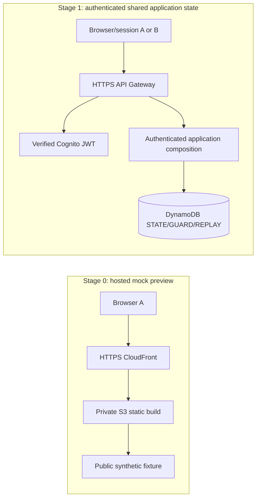

# Known Enough AWS staging runbook

Status: KE13A preparation and KE13C hosted build remain accepted. The separate KE13C release/bucket-policy follow-up has independent PASS on `f1893e3..6238700`; human acceptance and exact rendered ARN checks remain separate. [KE13A-P](../docs/tasks/KE13A-provisioner-policy.md) now prepares a [temporary provisioning permission candidate](stage0-provisioner-permission.md) under the user's explicit IAM CLI authorization. **Assignment is blocked:** CloudFront creation cannot enforce the single-preview specification or $25 planning ceiling through IAM, and the candidate requires independent critical review. The template has a past expiry and must not be assigned as-is. This remains a plan, not deployed infrastructure. No resource, permission-set, assignment, budget or deployment writes occurred. The bootstrap profile is root and was used only for read-only discovery; future authorized IAM bootstrap is distinct from application provisioning through a scoped SSO identity. All service commands use an explicit profile and `us-east-1`.

## Decisions and boundary

- Deployment region: `us-east-1` (N. Virginia), selected as a North America planning default with current public pricing examples. The IAM Identity Center **SSO region is also `us-east-1`**, confirmed separately as the Identity Center primary region.
- Monthly staging spend planning ceiling: **$25 USD**. The estimate below is for low traffic and is not a guaranteed hard limit. AWS Budgets data can update up to three times daily, typically with an 8–12 hour delay, so charges can pass an alert threshold before notification; budget actions also do not immediately stop every service or charge. See [AWS Budgets data freshness and alert timing](https://docs.aws.amazon.com/cost-management/latest/userguide/bcm-lite-use-budget.html).
- Stage 0 is an HTTPS static **hosted mock preview** backed only by public synthetic fixtures. Each browser sees mock state; it does not provide shared application state, authentication, or durable writes.
- Stage 1 adds verified Cognito identity, HTTPS API and durable DynamoDB state only after the required code, review gates and separate cloud-change approval. Separate sessions must read/write the same DynamoDB room state to demonstrate shared application state.
- SQS/DLQ is deferred until a real asynchronous worker exists. Bedrock/model calls are excluded and remain disabled until separately implemented and authorized.
- No Known Enough application resources, CDK bootstrap, deployment, paid call or external message has happened in KE13A. The user separately set up an IAM Identity Center directory user and assigned `ReadOnlyAccess`; the agent did not make these account/IAM changes.

## Current repository readiness

| Boundary | Existing evidence | Staging implication |
| --- | --- | --- |
| Web | The regular local [`App.tsx`](../apps/web/src/App.tsx) keeps its owner/local demo routes. The separate [`hosted-preview/index.html`](../apps/web/hosted-preview/index.html) entry fixes the public fixture and ignores query strings. | Build and upload only `apps/web/dist-hosted-preview/`; its bundle check rejects owner/local identity markers, and the browser smoke test checks hostile query strings and external requests. User accepted the reported independent PASS; see [review evidence](../docs/reviews/KE13C.md). |
| Local API | [`apps/api/README.md`](../apps/api/README.md) documents in-memory local state and fixed `NON_PRODUCTION` test labels. The local handler refuses `NODE_ENV=production`; its listener is loopback-only. | Never expose the local handler, test identity header or mock identities over the internet. They are not authentication. |
| Authenticated API | The Cognito JWT verifier and authenticated HTTP handler exist, but there is no production hosting/composition or deployed user pool. | KE13B must compose it with the durable repository and serverless entry point. Verify signed participant/display scopes; no fallback to local identities. |
| Persistence | The DynamoDB transaction adapter and strict codec exist in [`packages/adapters`](../packages/adapters/README.md); it does not create tables or prove managed AWS behavior. Current local STATE schema v4 is not a migration from durable v3 data. | KE13B must use one versioned DynamoDB table for shared state and preserve guard/replay/capacity semantics. No auto-migration; no durable v3 table may be bound to this version without a separately reviewed migration. |
| Workers/model | [`apps/workers/README.md`](../apps/workers/README.md) is a placeholder. | Do not create queues, invoke Bedrock or place private prompt text in SQS. Add SQS/DLQ and Bedrock only in their gated implementation scope. |

### What each stage proves



The Stage 0 browser only renders fixture state; one browser’s action cannot update another browser. Stage 1 is real shared state only after two independently authenticated, authorized sessions exercise the same deployed API and DynamoDB room, with transaction/version behavior verified. A static page, local API, mocked Cognito token or DynamoDB Local run does not meet that evidence.

## AWS CLI/profile setup and read-only verification

### Current discovery

- WSL initially had no `aws` executable. Windows `where.exe aws`, PowerShell command lookup and common Windows CLI v2 install paths also found no executable. WSL and Windows standard `~/.aws/config` paths are absent; `AWS_CONFIG_FILE`, `AWS_SHARED_CREDENTIALS_FILE`, `AWS_PROFILE` and region override variables were unset.
- Installed AWS CLI **v2.37.4** in the WSL user profile from AWS’s official Linux installer. The installer verified the package’s GPG signature. `aws --version` succeeded.
- At initial discovery, `aws configure list-profiles` returned no names and no standard WSL/Windows CLI profile existed. The user first created `known-enough-staging` with `aws login`; WSL could not auto-open the browser, but STS verified the account root principal. The user then ran `aws logout --profile known-enough-staging`, which removed the cached login credentials. The user created IAM Identity Center user `martelaxe`, assigned the AWS managed `ReadOnlyAccess` permission set to this account, and configured `known-enough-staging-ro`. Device-code SSO login completed; WSL could not auto-open the browser, but the user completed browser authorization. A repeat explicit-profile STS check succeeded for the `AWSReservedSSO_ReadOnlyAccess_…/martelaxe` assumed role. The account ID was reported directly to the user and is omitted here. The Identity Center dashboard primary region is `us-east-1`; `aws configure get region --profile known-enough-staging-ro` returned deployment region `us-east-1`. No login codes, tokens or authorization URLs are recorded here.

### Recommended path if the AWS account uses IAM Identity Center (SSO)

The user has configured this profile successfully. For another local setup, run these in WSL using the AWS access portal URL from the IAM Identity Center dashboard and that instance’s primary region. Do not put passwords, MFA responses, access keys, tokens or device codes in chat, source control, the runbook or logs. All service and permission-set changes below are CLI actions; a browser is used only when AWS CLI requests SSO/device authorization.

```sh
aws configure sso --profile known-enough-staging-ro --use-device-code
```

In the interactive wizard, enter the AWS access portal URL and **SSO region**; accept the default `sso:account:access` scope; choose the staging account and the least-privilege permission set; set the profile’s **deployment region** to `us-east-1`. This creates a local CLI profile. It does not create AWS infrastructure. Do not paste the profile config or SSO token cache into the repository.

Then authenticate and verify the selected account/role:

```sh
aws sso login --profile known-enough-staging-ro --use-device-code
aws sts get-caller-identity --profile known-enough-staging-ro --no-cli-pager
aws configure get region --profile known-enough-staging-ro
aws configure list-profiles
```

The Identity Center SSO region is shown as **Primary Region** on the Identity Center dashboard; the CLI profile region is the deployment region. Modern CLI profiles store the SSO region in their named `sso-session` section, so `aws configure get sso_region --profile ...` may not return it. Report the `Account` and the principal shown by `Arn` separately from both regions; if the ARN is an assumed role, record its role name, and if it is an IAM user, do not describe it as a role. If the CLI requests device authorization, complete that sign-in in a trusted browser; resource and permission changes below use the CLI.

```sh
aws sso login --profile known-enough-staging-ro --use-device-code
```

The CLI may display a one-time code in the terminal; enter it only at the AWS device authorization page. Do not copy the code into chat or project files.

### If access uses a different method

- Use the existing IAM Identity Center profile and its SSO flow. Do not replace it with long-lived keys.
- For an organization-provided assume-role or credential-process profile, follow that profile's existing local authentication method. Never send static keys or MFA codes to the assistant. Prefer short-lived, scoped credentials over long-lived IAM-user keys.
- Always pass the chosen profile on AWS service commands. Do not rely on an ambient default profile.

### Read-only identity checkpoint

After login, first run only the STS command above. Stop if the AWS account or role is not the intended staging authority. Record verified account/role details only in a human-approved private operations record, not a public frontend, browser payload, source code or credential file. **Current result: `known-enough-staging-ro` verifies as the `ReadOnlyAccess` assumed role.** This identity permits read-only verification, not staging deployment; request a separate scoped write permission set only after the stage and exact resources are approved.

## Proposed resource inventory

Names are examples only; apply a unique suffix after account/region identity is confirmed. Tag supported staging resources with `Project=KnownEnough`, `Environment=staging`, `Stage=preview` or `Stage=api`, and a cleanup date. The candidate CloudFront procedure creates untagged, then grants tagging on its observed exact ARN; this exception requires review. OAC has no supported tag operation in the inspected authorization reference.

| Stage | Resource | Purpose and limits |
| --- | --- | --- |
| Preview | Amazon S3 Standard bucket | Store only the reviewed `apps/web/dist-hosted-preview/` build. Block all public access, disable website hosting, use CloudFront Origin Access Control, default SSE-S3, versioned release assets and a 14-day cleanup for noncurrent versions. No private inputs or credentials. |
| Preview | Amazon CloudFront distribution | Serve S3 through OAC over HTTPS; set `DefaultRootObject=hosted-preview/index.html`. Prefer the CloudFront-provided domain and the $0 flat-rate Free plan if eligible; keep its published 1M requests/100 GB monthly allowance in view. Enable only the required security headers. Do not put participant values or identifiers in URLs/logs. |
| Preview | AWS Certificate Manager public certificate | Optional only for a custom domain. Request a non-exportable certificate in `us-east-1` for CloudFront. Integrated public certificates have no separate charge. The default CloudFront hostname already provides HTTPS. |
| Preview | Route 53 zone/records | Optional only if the user supplies an existing domain hosted in Route 53. Do not register or transfer a domain for this task. A hosted zone is billed monthly. |
| API | Amazon Cognito User Pool | Only after KE13B: participant and display app clients, public sign-up disabled, short access-token lifetime, administrator-managed display group; synthetic test accounts only. Avoid SMS MFA. Runtime JWT verification uses public JWKS and needs no Cognito API permission. |
| API | API Gateway HTTP API | HTTPS JSON API routes to Lambda, throttling enabled, JWT authentication/authorizer configured from verified Cognito issuer/client IDs. |
| API | AWS Lambda function(s) | Request composition; bounded memory/timeout and reserved concurrency; no VPC/NAT for the initial serverless path. Runtime role cannot provision infrastructure. |
| API | One DynamoDB Standard on-demand table | `DealTableRooms` with the existing adapter’s `ROOM#...` partition and STATE/GUARD/REPLAY sort keys. Single region; set supported on-demand throughput maxima after measured adapter sizing. No TTL for authorization/expiry. Do not enable global tables. |
| API | CloudWatch Logs groups, alarms and metrics | Redacted operational categories only; 7-day retention for staging; alert on error/throttle/cost signals. Never log JWTs, private input/conditions, prompts, grant IDs or refusal details. |
| Deferred | SQS standard queue + DLQ | Add only with a real reviewed async worker. Queue envelopes carry opaque job/authorized record references, not raw conversation text. Bound retention/redrive and cap worker concurrency. |
| Excluded | Bedrock, NAT Gateway, EC2, RDS, load balancer, paid domain registration, exportable/Private CA, SMS, global table, provisioned database capacity | Not needed for the first mock preview and would add variable or standing cost. Reconsider only under later explicit scope/approval. |

## Deployment sequence

No AWS deployment step below has been run. The user authorized Stage 0 only: one private S3 preview bucket and one CloudFront distribution with OAC in `us-east-1`, using the reviewed artifact and the stated low-traffic estimate under the `$25/month` planning ceiling. This authorization does not include a custom domain, API, Cognito, Lambda, DynamoDB, CDK bootstrap, Bedrock, or other stages. KE13A/KE13C do not perform a deployment.

1. **Confirm local auth and account.** Run `aws sso login --profile known-enough-staging-ro --use-device-code`, then `aws sts get-caller-identity --profile known-enough-staging-ro --no-cli-pager` and `aws configure get region --profile known-enough-staging-ro`. Stop unless the account and role are the intended account and `ReadOnlyAccess`. Cost Explorer previously reported estimated unblended cost of `$0` from 2026-09-01 through 2026-09-27; read-only inventory found no S3 buckets, CloudFront distributions or AWS Budgets. This does not reveal the remaining credit balance.
2. **Create the preview cost alert through the AWS CLI before resource creation.** An authorized billing-administrator profile must run `aws budgets create-budget` with a monthly `$25 USD` budget filtered to S3 and CloudFront, actual alerts at `$12.50`, `$20` and `$25`, and an 80% forecast alert sent to the account owner's confirmed email. Use that profile explicitly on the command. AWS Budgets alerts are not a guaranteed spend cap. Cost Explorer found no current service spend and no budget. AWS's [Budgets authorization reference](https://docs.aws.amazon.com/service-authorization/latest/reference/list_budgets.html) maps `CreateBudget` to `aws-portal:ModifyBilling` as well as `budgets:ModifyBudget`; because the former is broader than one budget, do not add it to the release role. No authorized billing-administrator profile is currently verified.
3. **Use the reviewed hosted-only mock build.** The accepted commit is `a625498`. It builds the fixed public fixture in `apps/web/dist-hosted-preview/`, ignores owner/local/scenario query strings and displays “Hosted mock preview — simulated data, no shared state.” Upload only this directory. The reviewer’s reported probes and two non-blocking permanent-check gaps are recorded in [KE13C build review](../docs/reviews/KE13C.md), with current output hashes.
4. **Resolve provisioning authority before resource creation.** Follow the [candidate policy and phase design](stage0-provisioner-permission.md). The proposed `KnownEnoughStage0Provisioner` is independent of the release permission set and has no IAM, Billing, bucket-policy, ACL, Block Public Access, ownership, encryption or object permissions. Its retained bucket writes are exact-name retention/tag configuration; inspect S3 default protections and stop on mismatch. It cannot install the bucket resource policy. Its CloudFront create actions necessarily have `Resource: "*"` and cannot constrain count, origin, configuration or cost; do not assign or use the candidate until independent review and an explicit residual-authority decision. The user authorized the IAM creation path, but this preparation phase makes no writes. Once those gates close, the exceptional bootstrap profile may create/assign only the reviewed permission set; application provisioning must use the separately authenticated scoped SSO profile. Initial CloudFront creation is untagged to avoid wildcard `TagResource`; after verifying its returned ARN, replace provisioning powers with exact-ARN tagging only. No application resource call is part of KE13A-P.

   After a later authorized provisioning session returns actual IDs, fail closed on every lookup: reject failed, empty, null, placeholder, foreign-account or ID-mismatched output; verify the ARN format and S3/OAC origin against the reviewed request. Render [the OAC-only bucket resource policy](permissions/ke13c-preview-bucket-policy.json) using only that verified ARN. A separate trusted administrator must review the rendered policy, install exactly that document with `--expected-bucket-owner 092954139775`, and read it back; no reusable provisioning/release role gets `s3:PutBucketPolicy`. The permission design documents this remaining trusted CLI gate. Initial defaults, versioning/lifecycle/tags, OAC settings, HTTPS behavior and the exact accepted build must be verified before upload. Use explicit `--profile "$STAGE0_PROVISIONER_PROFILE" --region us-east-1 --no-cli-pager` for the authorized provisioner; the separate bucket-policy action requires its own authorized trusted profile.

5. **Create the separate incremental-release permission set through the Identity Center CLI.** After the distribution exists, render the release policy to a temporary file using its exact ARN; keep the reviewed template unchanged:

   ```sh
   STAGE0_DISTRIBUTION_ARN="$(aws cloudfront get-distribution --id "$STAGE0_DISTRIBUTION_ID" --query 'Distribution.ARN' --output text --profile "$STAGE0_PROVISIONER_PROFILE" --region us-east-1 --no-cli-pager)"
   jq --arg arn "$STAGE0_DISTRIBUTION_ARN" '(.Statement[] | select(.Sid == "ReadAndInvalidateOnlyProvisionedPreviewDistribution") | .Resource) = $arn' infra/permissions/ke13c-stage0-deploy.json > /tmp/ke13c-stage0-release-policy.json
   ```

   An authorized Identity Center administrator can use `aws sso-admin list-instances`, `create-permission-set` (name `KnownEnoughStage0Release`, duration `PT1H`), `put-inline-policy-to-permission-set`, `create-account-assignment` for user `martelaxe` and the staging account, and `describe-account-assignment-creation-status`. Resolve `InstanceArn`, `IdentityStoreId` and the user's ID with the corresponding `aws sso-admin list-instances` and `aws identitystore list-users` read commands; pass `--profile "$STAGE0_IDENTITY_CENTER_ADMIN_PROFILE" --region us-east-1 --no-cli-pager` on each command. Attach the rendered `/tmp/ke13c-stage0-release-policy.json` with `--inline-policy file:///tmp/ke13c-stage0-release-policy.json`. Keep `ReadOnlyAccess`; do not include `s3:PutBucketPolicy`, resource creation/configuration, tagging, deletion, or wildcard distribution resources. The draft received independent PASS; assignment still needs its human acceptance, verified exact ARN rendering and revalidation. Reject a failed/empty lookup and validate the account, distribution ID, origin and OAC before the illustrative rendering command above; the command alone is not a validation guard.
6. **Authenticate the release profile.** Configure `known-enough-staging-deploy` with `aws configure sso --profile known-enough-staging-deploy`, selecting the same access portal, SSO region `us-east-1`, staging account, `KnownEnoughStage0Release`, and deployment region `us-east-1`. Then run `aws sso login --profile known-enough-staging-deploy --use-device-code` and verify with `aws sts get-caller-identity --profile known-enough-staging-deploy --no-cli-pager`. Stop unless STS shows the intended account and generated `AWSReservedSSO_KnownEnoughStage0Release_…` role.
7. **Release the accepted build through AWS CLI only.** With `apps/web/dist-hosted-preview/` built from the accepted commit, run these from the repository root:

   ```sh
   aws s3 sync apps/web/dist-hosted-preview/hosted-preview/ s3://known-enough-preview-20260927-7f94b6a1/hosted-preview/ --profile known-enough-staging-deploy --region us-east-1 --no-cli-pager
   aws s3 sync apps/web/dist-hosted-preview/assets/ s3://known-enough-preview-20260927-7f94b6a1/assets/ --profile known-enough-staging-deploy --region us-east-1 --no-cli-pager
   aws cloudfront create-invalidation --distribution-id EXACT_DISTRIBUTION_ID --paths / /hosted-preview/index.html --profile known-enough-staging-deploy --region us-east-1 --no-cli-pager
   aws cloudfront wait invalidation-completed --distribution-id EXACT_DISTRIBUTION_ID --id INVALIDATION_ID --profile known-enough-staging-deploy --region us-east-1
   aws cloudfront get-distribution --id EXACT_DISTRIBUTION_ID --query Distribution.DomainName --output text --profile known-enough-staging-deploy --region us-east-1 --no-cli-pager
   ```

   Replace both placeholders with values from the provisioning output. Do not use `--delete`; the release policy has no object-delete permission. No custom domain, ACM, Route 53, API, Cognito, Lambda or DynamoDB are in scope. Smoke-check TLS, page load, fixture behavior, no API calls, no test identity header and no private data in browser assets/logs. Record the distribution URL and build hash. A preview URL is not an authenticated app.
8. **Wait for KE13B and required reviews/acceptance.** Implement authenticated composition, durable adapter wiring, least-privilege IAM and focused checks. Retain KE00, B04/B04.5 and KE09 privacy/security gates.
9. **Request Stage 1 authorization.** Present the exact API/Cognito/Lambda/DynamoDB (and only if implemented, SQS/DLQ) resource list, exact account/region, permission diff, current estimate and rollback/cleanup plan. Do not bootstrap CDK, create service resources, deploy or call Bedrock until the user approves that concrete scope.
10. **Deploy the authenticated backend after approval.** Create the user pool and clients, API, Lambda and role, table and log groups; use a separate scoped setup identity and exact resource ARNs. No public sign-up, no `NON_PRODUCTION` fallback, no broad account admin policy on runtime. Store secrets only in an approved secret service if the implemented adapter requires them; avoid secrets for this first slice.
11. **Verify shared state with synthetic identities.** Provision fixed synthetic participants through the trusted control plane; authenticate separate clients; read the same room, commit a harmless authorized change from one client, and verify a separately authenticated client sees committed current state. Exercise cross-room/member denials, idempotent replay, conflict/retry, expiry and redacted errors. Verify DynamoDB persistence survives function cold starts; verify no private inputs appear in public projection/logs. These are live tests only when run against the deployed artifact and recorded as such.
12. **Operational review and acceptance.** Record account/role, region, artifact hash, exact resources, IAM policy hash, test identities as synthetic labels, logs/metrics, observed costs, failure/retry evidence, access lifetime and cleanup date. Run independent KE09 cloud-boundary follow-up; pause KE13 for human acceptance. KE13A/KE13B completion does not accept KE13.

## Cost estimate for the $25/month planning ceiling

Planning estimate dated 2026-09-26, in USD, for `us-east-1`; use the AWS Pricing Calculator with the actual account/usage before any creation. Assumptions: one small static build (<1 GB), ≤10 GB/month page delivery and ≤100,000 HTTPS requests; after Stage 1, ≤10,000 HTTP API calls/month, ≤10 synthetic monthly active users, one small on-demand table with 1–10 KB average items, ≤0.5 GB logs/month, no more than 10,000 async jobs if SQS is later added, no Bedrock, no SMS, no cross-region traffic and no purchased domain.

| Component | Low-traffic planning estimate | Cost basis / note |
| --- | ---: | --- |
| CloudFront preview distribution | `$0/month` if the flat-rate Free plan is available and usage is within 1M requests/100 GB. Otherwise budget roughly `$1–$3/month` for the stated small pay-as-you-go preview and verify in Calculator. | The Free plan includes CDN, TLS, DNS, logs and monthly S3 storage credits. Confirm account eligibility and plan terms before selecting it. |
| S3 static build | `$0–$0.10/month` | One small build and request volume; included S3 credits may cover it on a CloudFront plan. No cross-region or direct public S3 delivery. |
| ACM public certificate | `$0` for a non-exportable certificate used by CloudFront/API Gateway. | Custom domain only; CloudFront certificate is requested in `us-east-1`. |
| HTTP API Gateway | About `$0.01/month` at 10,000 requests. | AWS’s HTTP API example is `$1.00` per million requests in the first tier. Payload transfer is low under the stated size limit. |
| Lambda | About `$0.02/month` at 10,000 requests, 512 MB, 200 ms average, before free-tier credits. | Includes request and x86 duration estimate; actual duration, memory, retries and account free usage change this. |
| DynamoDB Standard on-demand | Roughly `$0.10–$1/month` at 10,000 small transaction paths, depending on STATE/item sizes and transaction units. | AWS lists US East examples at `$0.625/M` write units and `$0.125/M` read units; transactional operations consume extra units. Adapter operations and item bytes must be measured before finalizing. First 25 GB storage free tier only if available in this account. |
| Cognito | `$0` expected for ≤10 direct/social MAUs on Lite/Essentials, if the account’s free tier applies and SMS is not used. | SAML/OIDC federation has a 50-MAU free tier; higher tiers, advanced features, SMS and email delivery can add cost. Select and verify the tier. |
| CloudWatch | `$0–$0.25/month` for ≤0.5 GB log ingestion under the current 5 GB free allowance; otherwise `$0.50/GB` at the first standard ingestion tier, plus any retained storage/queries. | Seven-day retention and redacted, low-volume logs assumed. Do not enable verbose request logs. |
| SQS + DLQ, if later needed | `$0` expected at 30,000 request actions; then `$0.40 per million` standard queue requests after the first million monthly requests. | 10,000 jobs × send/receive/delete. Batch where appropriate; payload size and retries increase request count. |
| Route 53 hosted zone, optional | Add `$0.50/month` for the first hosted zone, plus queries. | Avoid by using the CloudFront hostname. Domain registration is excluded. |

**Planning total:** Preview only is approximately `$0–$3/month`. Preview plus low-traffic API/Cognito/DynamoDB is approximately `$1–$8/month`; add `$0.50/month` if a Route 53 zone is needed. The plan leaves headroom under `$25`, but traffic, logs, free-tier eligibility, retries, item size, domain registration, support, taxes or other pre-existing account usage can change the bill. AWS Budgets sends alerts and optional actions; it cannot guarantee a hard account spend cap. Keep Bedrock disabled because token/model/region usage is variable and is not included.

Official references: [AWS CLI v2 install](https://docs.aws.amazon.com/cli/latest/userguide/getting-started-install.html), [IAM Identity Center CLI setup/device flow](https://docs.aws.amazon.com/cli/latest/userguide/cli-configure-sso.html), [CloudFront actions and resource scopes](https://docs.aws.amazon.com/service-authorization/latest/reference/list_cloudfront.html), [S3 permissions and resource scopes](https://docs.aws.amazon.com/AmazonS3/latest/userguide/using-with-s3-policy-actions.html), [S3 default Block Public Access settings](https://docs.aws.amazon.com/AmazonS3/latest/userguide/create-bucket-overview.html), [IAM policy variables](https://docs.aws.amazon.com/IAM/latest/UserGuide/reference_policies_variables.html), [CloudFront plans](https://aws.amazon.com/cloudfront/pricing/), [S3](https://aws.amazon.com/s3/pricing/), [API Gateway](https://aws.amazon.com/api-gateway/pricing/), [Lambda](https://aws.amazon.com/lambda/pricing/), [DynamoDB](https://aws.amazon.com/dynamodb/pricing/), [Cognito](https://aws.amazon.com/cognito/pricing/), [SQS](https://aws.amazon.com/sqs/pricing/), [CloudWatch](https://aws.amazon.com/cloudwatch/pricing/), [ACM](https://aws.amazon.com/certificate-manager/pricing/), [Route 53](https://aws.amazon.com/route53/pricing/), [AWS Budgets authorization](https://docs.aws.amazon.com/service-authorization/latest/reference/list_budgets.html), [AWS Budgets pricing](https://aws.amazon.com/aws-cost-management/aws-budgets/pricing/) and [AWS Budgets alert timing](https://docs.aws.amazon.com/cost-management/latest/userguide/bcm-lite-use-budget.html). Prices/free allowances can change and can depend on account eligibility; recheck before authorization.

## Required permissions

The existing `ReadOnlyAccess` profile cannot deploy. The bootstrap profile is root; current work used it only for read-only inspection. The user's explicit IAM CLI authorization supports a later reviewed permission-set bootstrap phase, not application provisioning as root. Do not attach `AdministratorAccess`. The [provisioner candidate](permissions/ke13a-stage0-provisioner.json) and [limitations/phase design](stage0-provisioner-permission.md) require independent review and resolution of the CloudFront creation/spend limitation before assignment. The separate [release policy](permissions/ke13c-stage0-deploy.json) has independent PASS and retains its exact distribution placeholder until provisioning; it has no creation/configuration/tagging/Billing/IAM authority. A separately reviewed trusted action installs [the OAC-only bucket policy](permissions/ke13c-preview-bucket-policy.json). Neither reusable role can change it.

| Actor/stage | Permission families to request after review |
| --- | --- |
| Read-only verification | `sts:GetCallerIdentity`; no service mutation permission. |
| Preview initial provisioning (Stage 0) | Proposed temporary SSO permission set: exact named-bucket creation/retention/tagging plus create-only CloudFront/OAC; subsequent exact-ARN distribution tagging. Candidate is not assignable pending independent review and the documented uncapped creation limitation. Safe defaults are inspected; bucket policy installation and budget creation remain separate trusted administrator actions. Root is limited to the later explicitly authorized IAM bootstrap phase. |
| Preview incremental release | The [Stage 0 release policy](permissions/ke13c-stage0-deploy.json), after recorded independent PASS, human acceptance and rendered revalidation, substitutes the exact provisioned distribution ARN. It allows `s3:ListBucket` only with either allowed prefix, `s3:GetObject`/`s3:PutObject` only under `hosted-preview/*` and `assets/*`, and distribution read/invalidation actions only on that exact distribution ARN. It has no bucket-policy, bucket-configuration, create, tag, delete or wildcard-distribution action. |
| API staging control plane | API Gateway HTTP API create/update/delete; Lambda create/update/delete and pass execution role; Cognito user-pool/app-client/group provisioning; DynamoDB table create/describe/update/delete and billing-mode/on-demand limit configuration; CloudWatch log-group/retention/alarm management; optional SQS queue/DLQ create/update/delete only when worker code exists; AWS Budgets and cost-allocation-tag activation as authorized. IAM role/policy creation and `iam:PassRole` must be constrained to the exact staging roles and intended services. |
| Runtime API role | Existing adapter’s transaction-scoped DynamoDB item actions only: `dynamodb:GetItem`, `dynamodb:PutItem`, `dynamodb:UpdateItem` on the exact table ARN, with `dynamodb:EnclosingOperation` limited to `TransactGetItems`/`TransactWriteItems` and `dynamodb:LeadingKeys` limited to `ROOM#*`. Add only exact log-group write actions. No table administration, `DeleteItem`, `Query`, `Scan`, IAM, Cognito admin or broad resource wildcard. |
| Runtime worker role, only if implemented | Only the specific queue’s send/read/delete/get-attributes actions, exact table transaction needs and exact log group. No raw prompt text in the queue; do not grant Bedrock until its separate KE10 scope is authorized. |

The S3 bucket candidate is `known-enough-preview-20260927-7f94b6a1`. An explicit-profile `HeadBucket` check returned 404 on 2026-09-27. General-purpose S3 bucket names use a global namespace, so the name could be claimed before creation; if AWS returns `BucketAlreadyExists`, stop, select another name and edit the exact S3 ARNs in the policy before continuing.

The runtime IAM row reflects the current [`infra/README.md`](README.md) adapter design and is still a review example; re-check it against KE13B’s actual SDK commands and table ARN before authorizing. A key-prefix condition does not replace application membership authorization.

## Cleanup and expiry

Use synthetic test records only. Set a dated cleanup reminder at creation. Cleanup is a documented future procedure; do not execute it without explicit scope approval and resource-ID review.

1. Disable public preview traffic or restrict access; record the final build hash/evidence; remove DNS aliases only if they were created for this staging deployment.
2. Disable the CloudFront distribution and wait until deployment state is disabled; then delete the distribution and its Origin Access Control only after confirming no other distribution references it.
3. Delete every object version and delete marker from the dedicated build bucket; delete the bucket after CloudFront releases it. Confirm the bucket contains no unrelated objects.
4. For API staging, stop/disable API routes and Lambda event sources; delete the API and only the named Lambda functions. Remove only the scoped runtime role/policy after its functions are gone.
5. Purge synthetic SQS messages; delete the dedicated DLQ and source queue. Remove only matching staging log groups after exporting any approved redacted evidence; delete staging alarms/metrics that incur charges.
6. Delete Cognito synthetic users/groups and the dedicated pool/app clients after confirming no other stage depends on them. No private/real user data belongs in this pool.
7. Delete the dedicated DynamoDB staging table only after confirming it contains synthetic test state and no separate acceptance evidence needs retention. Check and remove on-demand backups, exports and point-in-time recovery state created for this stage; do not delete unrelated tables or backups.
8. Remove the optional ACM certificate after distribution/API associations are removed. Delete only staging Route 53 records. Do not delete a shared hosted zone or register/transfer a domain as part of cleanup.
9. Remove staging-specific budget filters, alarm targets and cost-allocation tags only if they were created solely for this stage; retain any account-wide budget or shared control. Verify the AWS bill and resource inventory after cleanup; record residual charges and the cleanup date.

## Open blockers / next action

- [KE13A-P](../docs/tasks/KE13A-provisioner-policy.md) is the current bounded candidate-policy task. Pause for independent critical review; no AWS writes are authorized in this preparation phase. The policy is deliberately expired and its tag ARN unresolved. CloudFront create permissions cannot enforce one distribution, the allowed origin/configuration or the $25 planning ceiling. Do not assign without resolving that limitation explicitly; the candidate is not a hard cost boundary.
- The user authorized creation of a scoped staging provisioning permission via CLI. Bootstrap STS confirms root in the intended account; only read-only operations were performed. No scoped provisioning role exists yet. Assignment must preserve the original read-only set, use only the reviewed new inline policy, and verify the generated SSO role; the bootstrap profile does not provision application resources.
- The accepted hosted build remains public synthetic mock data. The separate release/bucket-policy correction has independent PASS; its human acceptance, exact-resource rendering and validation remain prerequisites. The new provisioner policy does not inherit that PASS.
- A confirmed $25 S3/CloudFront budget alert and a trusted exact bucket-policy installation path remain needed before preview delivery. Alerts do not guarantee a hard cap. Fresh account-level S3 BPA lookup found no configuration; the candidate preserves and verifies bucket-level defaults rather than granting writes to weaken them.
- KE00 and KE13A remain accepted; B04/B04.5 remain REVIEW. KE13B, KE12 and final live KE13 gates are unchanged. No API/authentication/persistence/model work is authorized by the preview permission task.
